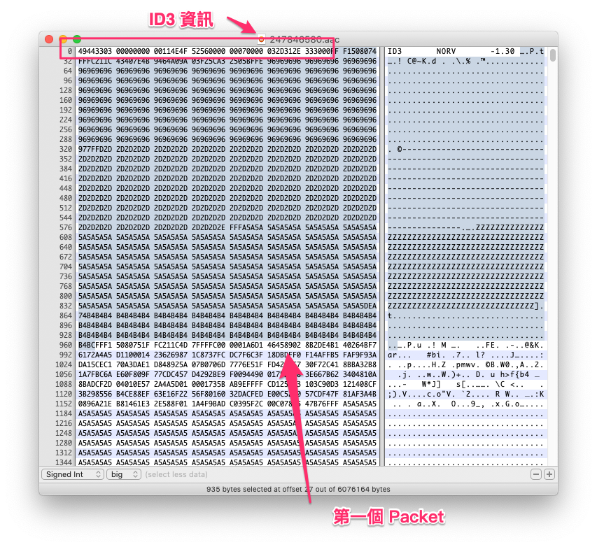
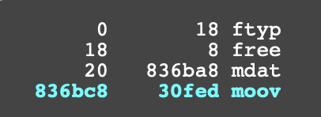
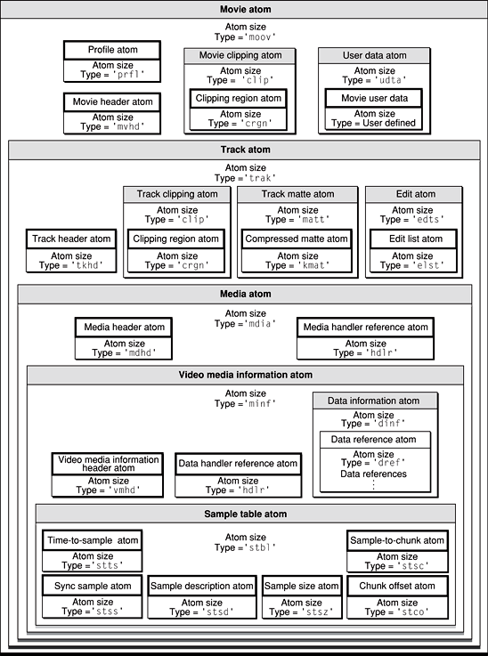

# AAC 與 MP4 格式

AAC 全名 Advanced Audio Encoding，是一種在上個世紀九零年代底訂出的規格。AAC 是一種 codec，但是可以被包在不同種類的 container 中，所以，我們通常不會單獨稱呼有某種檔案是 AAC 檔案，而是將 AAC 與 container 格式合稱，像是 AAC-MP4、AAC-ADTS…等。

## AAC-ADTS

AAC-ADTS 格式與 MP3 格式接近，一樣是一段 header 之後接著一個 packet，所以，我們也可以看到使用 AAC 格式的網路廣播電台。每個 packet 使用 AAC codec 壓縮，每個 packet 中包含 1024 個 frame，因此我們可以知道，使用 AAC-ADTS 產生出來的音檔的長度，與 MP3 是不同的。

AAC-ADTS 也有自己的 header 格式，長度在 7 到 9 個 bytes 之間。一般來說，附檔名是 `.aac` 的檔案，便是 AAC-ADTS 檔案。

打開 ADTS 的[規格](https://wiki.multimedia.cx/index.php/ADTS)，我們又看到「AAAAAAAA AAAABCCD EEFFFFGH HHIJKLMM MMMMMMMM MMMOOOOO OOOOOOPP (QQQQQQQQ QQQQQQQQ)」這種文字，我們既然處理過 MP3，我們也知道怎麼處理這種 header。

前 12 個 bit 是 syncword，所以，只要連續讀到 12 個 1，就可以判斷是 header 的開始。從第 30 個 bit 開始，也就是 M 這段，裡頭是整個 packet 的長度—請注意，這個長度也包含 header 的部份—只要繼續往下讀，就可以讀出 packet。

AAC-ADTS 格式也可能包含 ID3 檔頭。在 iOS/macOS 平台上，需要注意：Core Audio API 所提供的 parser 無法正確解析檔案前方有髒掉的資料的 AAC-ADTS 資料，我們需要自己寫一個 parser，手動把 Core Audio 無法解析的部份濾掉—也就是說，我們要自己想辦法找到第一個 syncword。

我們也可以打開 Hex Editor 看看。一個包含 ID3 資訊的 AAC-ADTS 檔案，可能會是像這樣：

## AAC-MP4

AAC-MP4 格式的檔案，通常副檔名是 `.mp4` 或 `.m4a`。而當我們在討論 HLS 以及 MPEG Dash 時，也需要知道：這些格式也建立在 MP4 格式上，像 HLS 裡頭的每個 TS 往往就是 MP4 檔案，而 MPEG Dash 更是相當倚賴一種叫做 fMP4 的格式。

MP4 格式淵源自蘋果的 QuickTime 格式，所以 MP4 可說與 QuickTime 互通。跟我們在前面講過的格式比較，MP4 container 有很多不同：

- MP4 不只是一種音樂格式，也是一種影片格式—某方面來說，我們可以把 MP4 container，想像成是一種把所有畫面都拿掉的影片
- MP4 是一種樹狀/巢狀的結構
- MP4 格式本身就有 metadata 的區段
- MP4 包含分開來的時間/資料如何對應的區段

我們來看一下每個 MP4 檔案的結構。

## Atoms

MP4 是以 **atom** 所構成。每個 atom，都可以想成是一個樹狀結構的節點，在樹狀結構的根部有一些基本 atom，在這些基本 atom 底下，每個子 atom（即 sub atom）是被一個上層節點所包圍。每個 atom 都有一段 header，header 當中包含這個 atom 的各種資訊，包括這個 atom 的 header 與 body 的長度、種類、ID、有多少子 atom…等（參見蘋果文件[QT Atoms and Atom Containers](https://developer.apple.com/library/archive/documentation/QuickTime/QTFF/QTFFChap1/qtff1.html#//apple_ref/doc/uid/TP40000939-CH203-38956)，這份文件也說明了 atom 的規格，在這邊不贅述），播放器在知道某個 atom 的意義之後，就可以繼續從這個 atom 的 Body 區段，繼續尋找這個 atom 的子 atom。

在 MP4 規格中，最上層的 atom 包括是 `ftyp`、`moov`、`mdat` 等最重要的區段，我們可以想像成在連續的 Binary Data 中，先被分成了這幾段，然後在下方還有其他 atom。假如我們拿 MP4 Parse 工具裡頭解析一個 MP4 檔案，就應該可以看到這些 atom：

- `ftyp`：用來標示這個 MP4 檔案的類型，像是這個檔案是部影片，或是只有音樂的音檔等
- `moov`：這個檔案相關的 metadata，像是歌手、專輯、歌曲名稱，或是封面圖等等。 MP4 可以標示的 metadata 相對來說比較複雜，比方說，一部影片可能有多個章節，那麼，`moov` 中就會包含各個章節的相關資料
- `mdat`：音檔資料實際被存放的位置
- 其他：在 MP4 的規格中，也定義了像是 `free`、`skip`、`wide` 這些類型的 atom，代表的是可以跳過的空資料

## MP4 格式如何達成快速 Random Seek

前面提到，在處理 MP3 或是 AAC-ADTS 格式的時候，必須要把整個檔案從頭到尾讀一遍，才知道有多少 packet，以及 packet 的所在位置，不利於快速計算歌曲的總長度，以及快速 seek 到某個位置播放。我們可以看一下 `moov` 以下有哪些 atom，方便解決 MP3 格式以及 ADTS 格式的問題：

以上圖片來自蘋果開發者網站 [QuickTime File Format Specification: Movie Atoms](https://developer.apple.com/library/archive/documentation/QuickTime/QTFF/QTFFChap2/qtff2.html#//apple_ref/doc/uid/TP40000939-CH204-SW1)。

我們可以注意到，在 `moov` 底下，包含像是 `stsz`、`stco` 等 atom，`stsz` 這個 atom 中包含的就是 packet 的數量，`stco` 則是每個 packet 在 `mdat` atom 中的 offset 位置。

在平台上所提供的全功能播放元件，像是 iOS/macOS 的 AVPlayer，在播放一個位在線上的 MP4 檔案的時候，會發出多條連線，嘗試在檔案的最前方或是最後方找到 `moov` 區段，然後從 `moov` 區段中找到 `stsz`、`stco` 等區段，有了 `stsz`，就可以畫出進度條，提供用戶做 random seek 的 UI，當用戶 seek 到某個地方的時候，就根據 `stco`，發送帶有 [Range](https://developer.mozilla.org/en-US/docs/Web/HTTP/Headers/Range) Header 的 HTTP 連線，從哪個地方抓取，如果沒有 `stsz` 以及 `stco`，才去把 `mdat` 讀過一遍，找出 packet 位置。如果是一份被燒錄在 DVD 或是藍光碟片的大檔，也一樣會嘗試先從檔案的最前方或是最後方，找到 `moov` 區段。

由於播放軟體在載入 MP4 檔案的時候，不是直接載入可以播放的資料，而是先去尋找 `moov` 區段，所以，在播放 MP4 的時候，其實可以感受到，會有一段前置處理的時間。像 Chromecast 上的 audio player，採取的就是這樣的播放行為，每次對 Chromecast 呼叫 random seek，往往就會觸發一個帶 Range header 的連線，而如果已經過了一分鐘才做 random seek，就會因為音檔已經不存在而無法播放，所以，我們在產品上，就做過在 Chromecast 上無法 random seek 的奇妙設計。

另外要注意：如果我們使用 iOS/macOS 上的 CoreAudio API 的 Audio Parser，像是 [AudioFileStreamID](https://developer.apple.com/documentation/audiotoolbox/audiofilestreamid)，就只能夠解析 `moov` 放在 `mdat` 前方的 MP4 檔案，不然就會跳出 [kAudioFileStreamError_NotOptimized](https://developer.apple.com/documentation/audiotoolbox/kaudiofilestreamerror_notoptimized) 錯誤，代碼的意思是「這個檔案沒有做過最佳化」，意思其實不清不楚，我們也是花了點時間才了解蘋果的意思。很多時候，我們在 iOS/macOS 上，可以用 QuickTime 或是 AVPlayer 播放的檔案，用 CoreAudio API 卻不見得有辦法播出，也就是說，蘋果在自己產品上使用的 Parser，跟開放給外部開發者使用的 API，其實是不同的。

## AAC-MP4 檔案

我們也可以拿 Hex Editor，打開一個 AAC-MP4 檔案看看。可以看到在最前方是 `ftyp` 欄位，標示這個檔案是 M4A，然後從第 36 個 byte 開始，就是 `mdat` 區段。

這個檔案的 `moov` 區段位在後方：

在 `moov` 當中包含 `stco` 這段用來方便做 random seek 的 atom：

另外，如果想要解析 MP4 檔案當中的 Atom，在網路上已經有不少現成的工具，光是用 Google 搜尋「MP4 Atom Parser」，就可以找到不少。我們簡單列出幾個：

- [mp4parser.com](http://mp4parser.com/)
- [onlinemp4parser.com](https://www.onlinemp4parser.com/)
- [mp4explorer](https://archive.codeplex.com/?p=mp4explorer)，用 C# 寫成的 Windows 程式
