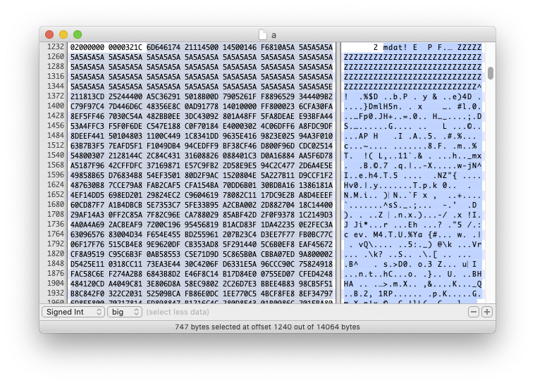
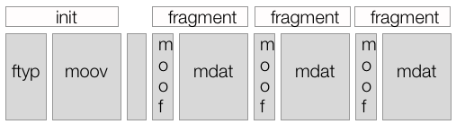
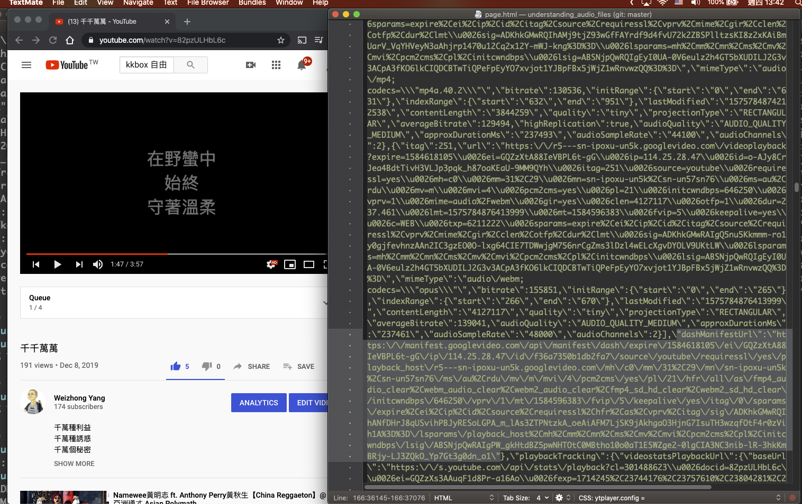
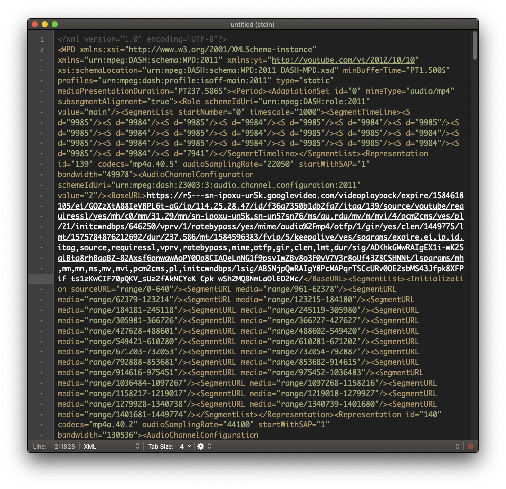
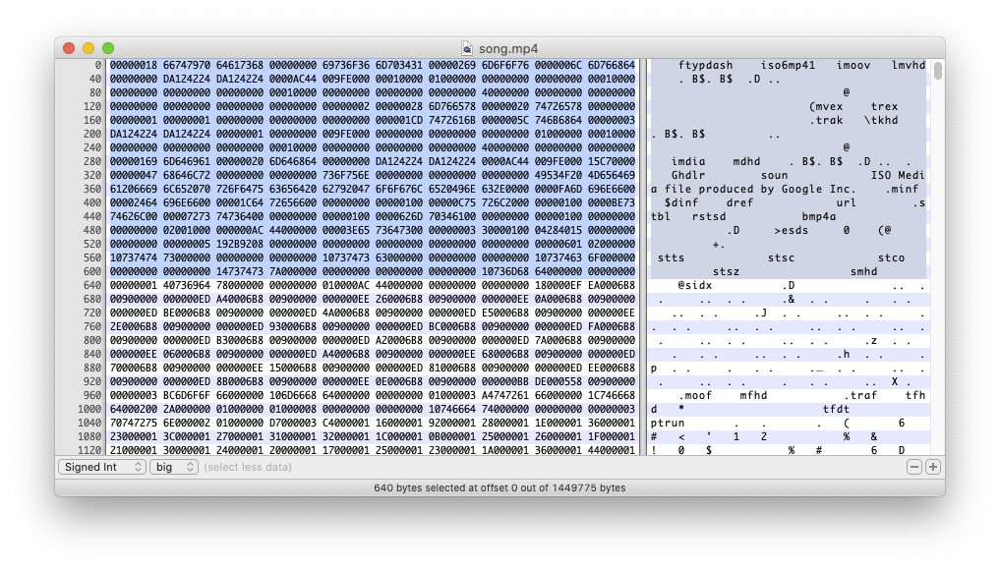
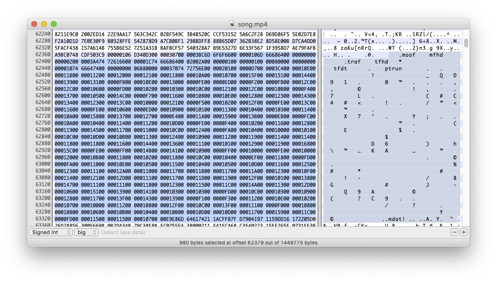

# MPEG-DASH 與 Widevine DRM

HLS 與蘋果生態系綁得非常緊密，在蘋果的生態系之外，就經常可以看到使用 MPEG-DASH 做為線上串流的解決方案。

DASH 是 Dynamic Adaptive Streaming over HTTP，大概可以翻譯成「基於 HTTP 上的動態適應串流」（通常不太會有人這樣稱呼），跟 HLS 一樣，可以用在直播/影片/音訊等各種媒體應用上。DASH 是一套 MPEG 公開標準，並且與許多的軟硬體廠商組成一個聯盟—[DASH IF](https://dashif.org/)（DASH Industry Forum），成員包括 Google、微軟、SONY、Intel、Akamai…等（參見 DASH IF 的[頁面](https://dashif.org/members/)）。

DASH 也是目前 Google 主要推廣的串流技術，我們可以看到 Google 為 Dash 格式做了許多播放軟體以及相關工具，而 [Widevine](https://www.widevine.com/) 便是 Google 用來保護 Dash 格式包裝的內容的 DRM 機制，用在 Chrome 瀏覽器、Android 行動裝置與 Android TV 上。

從名稱上就可以看出，Dash 與 HLS 相近，也是一套建立在 HTTP 的基礎上，利用 HTTP server 的能力承受大量連線與流量。所以，在 Dash 與 HLS 之間，雖然是不同的格式，但是有一些觀念可以互通：例如，HLS 的 playlist 檔案是 `.m3u8` 檔案，在 Dash 中可以對應到 **MPD**，在 HLS 中，實際的影音資料是放在 TS 檔案中，在 Dash 中則使用 **fMP4**（Fragmented MP4）格式。

## MPD

播放 HLS 的時候，播放器要先載入 `.m3u8` 檔案，在播放 Dash 的時候，則要讓播放器載入 MPD，全名是 Media Presentation Description。

MPD 的格式與 `.m3u8` 有些不同， `.m3u8` 檔案是一行一行寫下來的文字格式，MPD 則是 XML 格式，當中記錄了這個串流（影片或聲音）的基本資料，以及實際上要載入的媒體資料位置。

在 DASH-IF 網站上，有一些[測試用的 MPD](https://reference.dashif.org/dash.js/latest/samples/dash-if-reference-player/index.html)，可以讓我們了解 Dash 規格。我們來打開其中一個看看， [48K AAC LC Stereo Beeps](https://livesim.dashif.org/dash/vod/testpic_2s/audio.mpd) 是一個只會連續發出一個小時嗶嗶聲的純 audio 串流，當中內容是這樣的：

```xml
<MPD xmlns:xsi="http://www.w3.org/2001/XMLSchema-instance" xmlns="urn:mpeg:dash:schema:mpd:2011" xsi:schemaLocation="urn:mpeg:dash:schema:mpd:2011 DASH-MPD.xsd" profiles="urn:mpeg:dash:profile:isoff-live:2011,http://dashif.org/guidelines/dash-if-simple" maxSegmentDuration="PT2S" minBufferTime="PT2S" type="static" mediaPresentationDuration="PT1H">
   <ProgramInformation>
      <Title>Media Presentation Description for audio only from DASH-IF live simulator</Title>
   </ProgramInformation>
   <Period id="precambrian" start="PT0S">
      <AdaptationSet contentType="audio" mimeType="audio/mp4" lang="eng" segmentAlignment="true" startWithSAP="1">
         <Role schemeIdUri="urn:mpeg:dash:role:2011" value="main"/>
         <SegmentTemplate startNumber="1" initialization="$RepresentationID$/init.mp4" duration="2" media="$RepresentationID$/$Number$.m4s"/>
         <Representation id="A48" codecs="mp4a.40.2" bandwidth="48000" audioSamplingRate="48000">
            <AudioChannelConfiguration schemeIdUri="urn:mpeg:dash:23003:3:audio_channel_configuration:2011" value="2"/>
         </Representation>
      </AdaptationSet>
   </Period>
</MPD>
```

在檔案的開頭，我們先看到一堆 XML 宣告。這個 XML 的 root node 是 `MPD`，然後 XML 的 scheme 位在哪個位置…。接下來 `ProgramInformation` 是關於內容的描述，我們知道這個影片的標題是「Media Presentation Description for audio only from DASH-IF live simulator」。

然後是 `Period` 與 `AdaptationSet`。`Period` 表示的是這個節目有哪些時間區段，比方說，如果這個 MPD 表示的是一場演唱會，那麼，我們就可能會用上多個 `Period`，表示演唱會當中每一首歌的時間區間。在這段時間內，可以有多種不同品質（音質或畫質）的媒體可以選用—比方說，如果是影片的話，就可能有 360p、480p…等等不同的解析度—播放器會根據目前的網路狀況選擇最適合的。

`AdaptationSet` 就代表一組可用的畫質/音質，相關的檔案位置與 codec 資訊…等。在這個檔案中，由於只有一種音質的資料，所以也就只有一組 `AdaptationSet`，在有多種品質可以挑選的 MPD 中，就會看到多組 `AdaptationSet`。

從 `SegmentTemplate` 中，我們可以看到音檔的 URL 的組合規則：

```xml
<SegmentTemplate startNumber="1" initialization="$RepresentationID$/init.mp4" duration="2" media="$RepresentationID$/$Number$.m4s"/>
```

這代表，根據 `initialization` 當中的資料，我們應該首先載入 init.mp4，然後根據編號（$Number$ 是一個變數，是從 1 開始的一連串數字）逐一載入後面的 m4s 檔案。在組成 URL 的時候，首先根據 MPD 所在的位置，找出這些檔案應該所在的根目錄路徑。

- 這個 MPD 位在 `https://livesim.dashif.org/dash/vod/testpic_2s/audio.mpd`
- 所以這些檔案應該位在 `https://livesim.dashif.org/dash/vod/testpic_2s/` 之下
- 我們要填入 `RepresentationID`，從 MPD 中可以看到，這邊的 ID 是 `A48`，所以再把這段加到 URL 上：
  `https://livesim.dashif.org/dash/vod/testpic_2s/A48/`
- init.mp4 就位在 `https://livesim.dashif.org/dash/vod/testpic_2s/A48/init.mp4`
- 後面的檔案規則就是 `https://livesim.dashif.org/dash/vod/testpic_2s/A48/1.mps`，依此類推

## fMP4

我們在講解 AAC 格式的時候提到 MP4 格式，也講到一個單獨的 MP4 的檔案，裡頭需要 `ftyp`、`moov`、`mdat` 這些基本的 atoms。

在 DASH 中，我們把這些 atom 拆開：init.mp4 當中存放 `moov`，$Number$.m4s 裡頭則存放 `mdat` 資料，每個 m4s 檔案是把 `mdat` 中的影片資料根據一段定義好的時間長度切出來的小檔，這樣的小檔叫做 fragment。在播放的時候，播放器首先抓取 `moov`，然後一次又一次把這段 `moov` 與後面從 M4S 檔案中拿到的 `mdat` 結合起來播放。init.mp4 與 m4s 檔案中還有一些其他的 atoms，姑且不表。

在 init.mp4 中的 `moov` 資訊：


在 M4S 當中的 `mdat` 資訊：



我們在前面看到使用 `SegmentTemplate` 的範例，另外一種定義 m4s 檔案位置的作法，則是直接全部列出來。比方說，我們可以看一個來自 Wowza 的範例，這個 MPD 位在 `https://wowzaec2demo.streamlock.net/vod/elephantsdream_1100kbps-enc-wv.mp4/manifest_mvlist.mpd`，就寫成：

```xml
<SegmentList presentationTimeOffset="0" timescale="90000" duration="900000" startNumber="1">
    <Initialization sourceURL="chunk_ctvideo_ridp0va0br994339_cinit_w1146251977_mpd.m4s"/>
    <SegmentURL media="chunk_ctvideo_ridp0va0br994339_cn1_w1146251977_mpd.m4s"/>
    <SegmentURL media="chunk_ctvideo_ridp0va0br994339_cn2_w1146251977_mpd.m4s"/>
    <SegmentURL media="chunk_ctvideo_ridp0va0br994339_cn3_w1146251977_mpd.m4s"/>
    ...
</SegmentList>

```

### 連續的 fMP4

另外一種常見的作法，則是使用 fMP4 格式的檔案提供影音資料。

因為我們已經看過前面用 init.mp4 加上一堆 M4S 檔案的例子，我們於是比較容易理解 fMP4 格式：fMP4 就是把這些檔案合併成一個大檔案。然後，MPD 當中會標明每個對應到一個 M4S 格式的 byte range，播放器在載入 MPD 之後，先抓取 fMP4 的開頭部分（對應到我們的 init.mp4），然後，根據 MPD 中定義的 byte range，透過帶有 Range HTTP header 的連線，只抓取 fMP4 檔案中想要的部份。

這個檔案的資料大概像這樣：



我們可以來看看 YouTube 使用的 DASH 檔案。比方說，我們在 YouTube 上，打開一個我們自己上傳的頁面（在這邊用的是我在 2019 年寫的一首歌[《千千萬萬》](https://www.youtube.com/watch?v=82pzULHbL6c)），然後查看頁面的 HTML 原始檔，就可以找到 dashManifestUrl 這段：



因此我們可以知道，這部影片的 MPD 位在 `https://r5---sn-ipoxu-un5k.googlevideo.com/videoplayback/expire/1584618105/...` 。我們可以打開來看看（不過，這個 URL 有效期，你現在點下去應該沒用）：



我們於是可以找到：首先，這部影片有一段資料格式是 `audio/mp4` 的 `AdaptationSet`，代表 YouTub 幫我們把影片的圖片跟音軌拆開來了，這邊有一段獨立的音軌，URL 也是位在 `https://r5---sn-ipoxu-un5k.googlevideo.com/videoplayback/expire/1584618105/...` 下方：

然後是這兩段：

```xml
<SegmentList startNumber="0" timescale="1000"><SegmentTimeline><S d="9985"/><S d="9984"/><S d="9985"/><S d="9984"/><S d="9985"/><S d="9984"/><S d="9985"/><S d="9985"/><S d="9984"/><S d="9985"/><S d="9984"/><S d="9985"/><S d="9985"/><S d="9984"/><S d="9985"/><S d="9984"/><S d="9985"/><S d="9984"/><S d="9985"/><S d="9985"/><S d="9984"/><S d="9985"/><S d="9984"/><S d="7941"/></SegmentTimeline></SegmentList>
```

```xml
<SegmentList><Initialization sourceURL="range/0-640"/><SegmentURL media="range/961-62378"/><SegmentURL media="range/62379-123214"/><SegmentURL media="range/123215-184180"/><SegmentURL media="range/184181-245118"/><SegmentURL media="range/245119-305980"/><SegmentURL media="range/305981-366726"/><SegmentURL media="range/366727-427627"/><SegmentURL media="range/427628-488601"/><SegmentURL media="range/488602-549420"/><SegmentURL media="range/549421-610280"/><SegmentURL media="range/610281-671202"/><SegmentURL media="range/671203-732053"/><SegmentURL media="range/732054-792887"/><SegmentURL media="range/792888-853681"/><SegmentURL media="range/853682-914615"/><SegmentURL media="range/914616-975451"/><SegmentURL media="range/975452-1036483"/><SegmentURL media="range/1036484-1097267"/><SegmentURL media="range/1097268-1158216"/><SegmentURL media="range/1158217-1219017"/><SegmentURL media="range/1219018-1279927"/><SegmentURL media="range/1279928-1340738"/><SegmentURL media="range/1340739-1401680"/><SegmentURL media="range/1401681-1449774"/></SegmentList>
```

在 `SegmentTimeline` 當中，列出了這個音軌當中的時間軸，整個音軌被切成 24 的片段，每個 `S` 代表一個片段，裡頭的 `d` 則是這個片段的 duration，時間單位則根據 `SegmentTimeline` 當中的 `timescale`。以第一個 `S` 為例，代表的是這首歌的第一個時間區間，`d` 為 9985，`timescale` 為 1000，所以我們可以算出是 9.985 秒，整部影片大概是以十秒鐘為一個區間切成小片，最後一個 `S` 將近八秒，所以全部大概有 238 秒（3 分 58 秒）。

每個 `S` 會對應到 `SegmentList` 裡頭的 `SegmentURL`。SegmentList 第一段 `Initialization` 就代表我們之前講到的 init.mp4 的角色，裡頭包含 `ftyp` 與 `moov` 等 atoms，這段在第 0 到第 640 個 byte 的位置，後面每個 `SegmentURL`，也都代表這個區段在檔案中的哪個 byte 到哪個 byte 的區間。

所以，假如我們在播放這個檔案的時候，一開始就想從第 15 秒開始播放，我們就可以算出，第 15 秒位在第二個 `S` 定義的區段，這時候就只要發出帶 Range header 的 HTTP 連線，先抓取 0-640 的 `ftyp` 與 `moov` 等資訊，再直接去找第二個 `S` 的範圍 62379-123214，在載入這段檔案後，因為第二個 `S` 是從第 10 秒開始，只要再 seek 五秒鐘，就可以成功達成「從第 15 秒開始播放」。

我們可以打開這個檔案看看：

從 0-640，可以看到 `ftyp` 與 `moov`。



從 62379 的一段 `mdat` 資料：



## 播放 MPEG-DASH 串流

播放 MPEG-DASH 串流的流程大概是：

- 抓取 MPD，並且解析裡頭的 XML
- 從 MPD 中判斷有哪些 `Period` 與 `AdaptationSet`
- 從 `AdaptationSet` 中挑選最適合目前頻寬的影片/音軌的組合
- 從 `AdaptationSet` 中組合出實際的 URL 播放

DASH IF 本身提供一套 JavaScript 撰寫的播放軟體 [dash.js](https://reference.dashif.org/dash.js/)，Google 這幾年在 Android 平台上致力推廣的 [ExoPlayer](https://developer.android.com/guide/topics/media/exoplayer) 也支援 DASH 格式，另外也有一套在網頁上播放 DASH 的 [Shaka Player](https://shaka-player-demo.appspot.com/demo/#audiolang=en-US;textlang=en-US;uilang=en-US;panel=HOME;build=uncompiled)，Google 在 Widevine SDK 的文件中，就建議使用這兩個 Player 元件。此外，還有各種支援 MPEG DASH 的實作，在這邊不一一列舉。

在 iOS app 中播放 DASH 串流的方式有點迂迴。在 iOS 上我們看到的不是可以直接播放 DASH 的播放元件，而是把 DASH 轉成 HLS，然後用 AVPlayer 播放。

Google 有一套叫做 [Universal DASH Transmuxer](https://github.com/google/universal-dash-transmuxer)（簡稱 UDT）的軟體，是一套 Open Source 的函式庫，在 GitHub 上可以取得程式碼，裡頭就是將 DASH 轉換成 HLS 的相關實作，至於實際怎麼用，還是得看 Google 的 Widevine iOS SDK，但這部份沒有 Open Source。

基本原理是：

- 先在 app 中，開啟一個 local 的 HTTP server
- 這個 local HTTP server 在背後抓取一個指定的 MPD
- 解析 MPD，把裡頭的 `AdaptationSet` 抽取出來，轉換成 `.m3u8` 格式的 playlist，抓取 fMP4 的初始區段
- 如果是受保護的 DASH 串流，這時候會去抓取 license
- 當有 player 指定要播放某一段的 TS 時，local http server 在收到要求之後，再根據之前取得的 MPD，把對應的 M4S 檔案抓下來，並且轉換成 TS 格式回應
- 如此不斷輪迴

## Widevine

Widevine 保護內容的方式，是對 `mdat` atom 中的資料加密。一個受到 Widevine 保護的檔案，外觀上還是可以看出是一個 MP4 檔案，還是可以解析出 `ftyp`、`moov`、`mdat` 這些 atom，播放器需要先解析出 `mdat` 區段的資料，再透過一份 license 以及 Google 的演算法，把裡頭的資料解密回來。

一個受到 Widevine 保護串流中，會在 MPD 當中，每一段 `AdaptationSet` 中，包含一段 **PSSH**（Protection System Specific Header）資訊。我們可以看一個[來自 Wowza 的 MPD](https://wowzaec2demo.streamlock.net/live/bigbuckbunny-enc-wv.stream/manifest_mvtime.mpd)，就可以看到這段：

```xml
<AdaptationSet id="0" group="1" mimeType="video/mp4" width="512" height="288" par="16:9" frameRate="30" segmentAlignment="true" startWithSAP="1" subsegmentAlignment="true" subsegmentStartsWithSAP="1">
    <ContentProtection schemeIdUri="urn:mpeg:dash:mp4protection:2011" value="cenc" cenc:default_KID="0294B959-9D75-5DE2-BBF0-FDCA3FA5EAB7"/>
    <ContentProtection schemeIdUri="urn:uuid:edef8ba9-79d6-4ace-a3c8-27dcd51d21ed" value="Widevine">
        <cenc:pssh>AAAAW3Bzc2gAAAAA7e+LqXnWSs6jyCfc1R0h7QAAADsIARIQApS5WZ11XeK78P3KP6XqtxoNd2lkZXZpbmVfdGVzdCIQZmtqM2xqYVNkZmFsa3IzaioCU0QyAA==</cenc:pssh>
    </ContentProtection>
    <SegmentTemplate ....> ... </SegmentTemplate>
    <Representation id="p0va0br676240" codecs="avc1.42c015" sar="1:1" bandwidth="676240" />
</AdaptationSet>
```

在 `<cenc:pssh>` 欄位中，就是我們所要的 PSSH 資訊，PSSH 接近我們在 HLS 裡頭用到的 Asset ID—在 HLS 裡頭，我們用 Asset ID 與蘋果簽發的 certificate 產生 SPC，在 Widevine 裡頭，我們也用 PSSH 與 **CDM** 產生出來的資訊，產生授權需求，上傳到 server 上產生、取得解密用的 license。

CDM 全名 Content Decryption Module，在行動平台上，CDM 是一套用 C++ 寫成的 library，在每種平台上 CDM 的專屬軟體叫做 CDM host，Google 只有給第三方廠商編譯好的 binary 以及 certificate。

我們首先用一些基本的裝置資訊，對 CDM host 進行初始話，然後，在抓到 PSSH 之後，我們把 PSSH 送到 CDM host 上，CDM host 再 callback 回來，回傳 CDM 組合好的憑證需求的資料，CDM 會把這段資料，送到我們的一段代理人程式－術語是發送（send）一段訊息（message）—我們就可以把這段資料傳到 Google 的 License Proxy 主機上（像 `https://license.widevine.com/getlicense/<provider>` 這樣的網址，參見 [Google 文件](https://support.google.com/widevine/answer/6048495?hl=en)），取得 license。

Google 提供的流程圖如下，再知道一些專有名詞的意義後，會比較好懂。這一段是傳送 PSSH 取得 license 的流程


在 Android 上，ExoPlayer 支援 Widevine DRM，詳情可以參考 ExoPlayer 的文件 [Digital rights management](https://exoplayer.dev/drm.html)，主要是透過 Android 本身的 [MediaDrm](https://developer.android.com/reference/android/media/MediaDrm.html) API 管理 DRM。

在 iOS 上，拿到 license 之後，就可以為播放器準備 HLS 格式的串流：


Web 上，這整套取得 license 的流程，被包在 EME 裡頭，Google 有一篇文件專門介紹 EME：[What is EME?](https://developers.google.com/web/fundamentals/media/eme)。至於播放軟體方面，Google 也一樣推薦用 Shaka Player 播放 Winevine 保護的 Dash 串流。

### 離線下載

Widevine 也支援離線播放。基本上，要下載一個 DASH 格式的串流，就是先打開 MPD、解析裡頭的內容，然後根據 `SegmentTemplate` 或 `SegmentList` 找到對應的檔案，把所有檔案以及 MPD 全部下載回來，然後在本地端維持相同的目錄結構即可。

在播放離線檔案之前，一樣要一份 license，取得 license 的流程與線上播放的流程一模一樣，不過，需要額外跟告訴 CDM 我們要的是離線用的 license。取得 license 之後要自己在本機存放起來，並且注意這份 license 的期限是否過期—CDM 中有相關的 function，可以檢查 license 的到期時間，不過用戶似乎可以把系統時間改到過去，這點我們還沒有研究得很深。

### 在 iOS 上播放 Widevine 保護的 DASH 串流

前面提到，在 iOS 上播放 Dash 時，會在中間透過 UDT 轉換成 HLS 播放，而如果用 Widevine 的 iOS SDK 播放，轉換出的 HLS，會另外重新加密。iOS 版本的 Widevine DRM 裡頭也有一份 UDT，但這份 UDT 跟開放原始碼版本的 UDT 不同，中間加上了重新加密這段，而且 Google 也只有提供我們 binary 版本。
