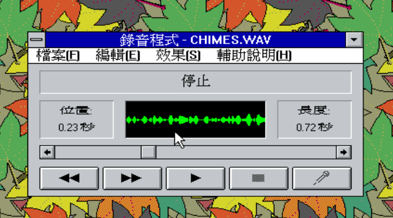
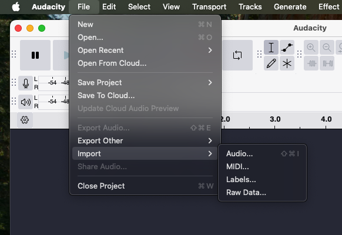
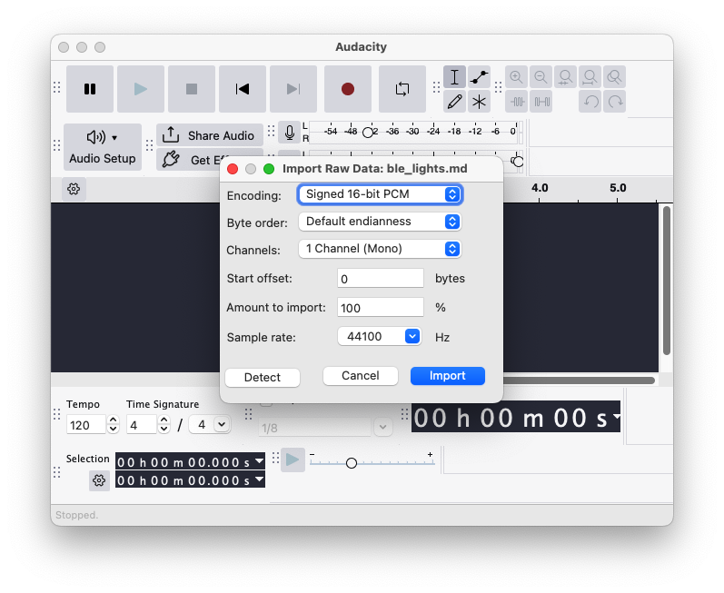
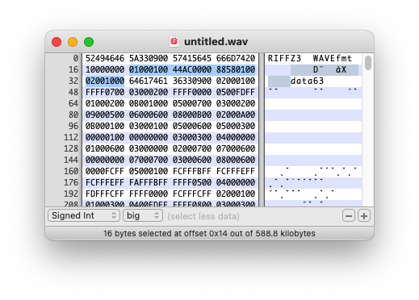
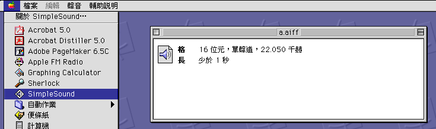

# WAV 格式

我們在前一章當中當中提到了 PCM 格式，就是沒有接過壓縮的、直接使用數字表示聲音波形原始音檔。由於我們一定得清楚知道當中的一些基本資訊，像是這個檔案中到底包含了多少個聲道、採樣率、每個聲道的數字格式…等，所以這種格式的音檔，通常都會有一個檔頭（Header），用來描述這些資訊。而因為檔頭的格式不同，所以也產生了很多不同的檔案格式，像是 WAV、AIFF…等。這些檔案格式的音檔，都是 PCM 格式的音檔，只是它們的檔頭格式不同而已。

WAV 可說是各種沒有壓縮過的 PCM 格式中最常見者，副檔名是 .wav。WAV 格式的普及或許跟 90 年代開始 Windows 平台開始普及有關，從 Windows 3.1 開始，無論是系統當中使用的音效聲，或是錄音程式所錄製出的檔案，都是 WAV 格式。而讀到這邊，相信您也應該可以理解，就算同樣是 WAV 檔案，也都會有採樣率、聲道數量的不同。



## 沒有檔頭的狀況

有些時候我們會遇到一些沒有檔頭的聲音檔案，像是從某些特定的硬體直接錄製出來的資料，或是自己寫程式產生一些數字。那麼，一般的播放軟體，就會因為缺少必要的資訊而無法播放，或是猜錯了裡頭的格式，導致播放出了奇怪的聲音出來。

[Audacity](https://www.audacityteam.org/) 是一套好用而且跨平台的聲音編輯軟體，在缺少檔頭的狀況下，就可以用裡頭的 Import Raw Data 功能，將沒有檔頭的 PCM 檔案匯入。方法是，先選擇 Import，然後從選單中選擇 Raw Data。如下圖：



然後自行輸入檔案的格式資訊。如下圖：



- Encoding：就像是前一章所提到的各種數字格式，最常見的是使用帶正負號的 16 位元整數（Sint16）。
- Byte order：如果是兩個 char 以上組成，就會有 big endian 或是 little endian 的問題，其中 litten endian 會比較常見。如果是只有一個 char ，也就是 8 位元整數（Sint8），就不會有這個問題，可以選擇 no endian。
- Channels：聲道數量，通常是 1 或 2。有一些錄音設備可能會多出一些 reference channel，就會超過這個數字。
- Start offset：可能一些檔案前面，雖然沒有標準檔頭，但還是寫入了一些額外的資訊。我們可以設定一個 offset 的長度，排除這些不是聲音本身的資料。
- Amount to import：我們要匯入的比例，通常是 100%，代表要匯入全部的資料。
- Sample rate：就是前一章所講的採樣比例。

## MP3 檔頭

MP3 的檔頭格式定義在微軟與 IBM 一起定義的 [RIFF](https://en.wikipedia.org/wiki/Resource_Interchange_File_Format) （Resource Interchange File Format）當中。RIFF 檔案格式的結構是由一個或多個 chunk 組成，每個 chunk 都有一個 ID 和一個 size，ID 用來識別這個 chunk 的類型，size 則是這個 chunk 的大小。

一個 MP3 檔案的結構如下：

| chunk       | 長度       | 內容                              |
| ----------- | ---------- | --------------------------------- |
| "RIFF"      | 4          | 就是 RIFF 這四個字                |
| chunk size  | 4          | 描述整個檔案的大小                |
| "WAVE"      | 3          | 就是 WAVE 這四個字                |
| "fmt " 區段 | 4 + 4 + 16 | "fmt " 區段開頭 + 大小描述 + 內容 |
| "data" 區段 | 4 + 4 + n  | "data" 區段開頭 + 大小描述 + 內容 |

### fnt 區段

"fmt " 區段的結構如下：

```c
struct fmt_chunk {
  char     chunk_id[4];     // "fmt "
  uint32_t chunk_size;      // 16 for PCM
  uint16_t audio_format;    // 1 for PCM
  uint16_t num_channels;    // 1 = mono, 2 = stereo
  uint32_t sample_rate;     // 44100, 22050, etc.
  uint32_t byte_rate;       // = sample_rate * num_channels * bits_per_sample/8
  uint16_t block_align;     // = num_channels * bits_per_sample/8
  uint16_t bits_per_sample; // 8, 16, etc.
};
```

- 一開始的 chunk_id 是 "fmt "，這是 RIFF 檔案格式的規定。
- chunk_size 是這個 chunk 的大小，對於 PCM 格式來說，這個值是 16。請注意，這邊的數字都是 little endian 的格式。
- audio_format 是音檔的格式，對於 PCM 格式來說，這個值是 1。
- num_channels 是聲道數量，1 代表單聲道，2 代表立體聲。
- sample_rate 是採樣率
- byte_rate 是每秒的位元組數，這個值是由採樣率、聲道數量和每個樣本的位元數計算出來的。對於 PCM 格式來說，這個值是 `sample_rate * num_channels * bits_per_sample/8`。請參見前一章的說明
- block_align 是每個樣本的位元組數，這個值是由聲道數量和每個樣本的位元數計算出來的。對於 PCM 格式來說，這個值是 `num_channels * bits_per_sample/8`。
- bits_per_sample 是每個樣本的位元數，以 Sint16 為例，這個值是 16。

### data 區段

"data" 區段的結構如下：

```c
struct data_chunk {
  char     chunk_id[4]; // "data"
  uint32_t chunk_size;  // size of the data
  uint8_t  data[n];     // the actual sound data
};
```

- chunk_id 是 "data"，這是 RIFF 檔案格式的規定。
- chunk_size 是這個 chunk 的大小，這個值是 `size of the data`。
- data 是實際的 PCM 聲音資料

我們來實際打開一個 MP3 檔案看一下：



這個檔案的檔頭部分就是：

```
52 49 46 46   // "RIFF"
5A 33 39 00   // 檔案大小 = 0x0039335A = 3755354 bytes (檔案總長 - 8)
57 41 56 45   // "WAVE"
66 6D 74 20   // "fmt "
10 00 00 00   // chunk size = 16 bytes (PCM)
01 00         // audio format = 1 (PCM)
01 00         // channels = 1 (mono)
44 AC 00 00   // sample rate = 0x0000AC44 = 44100 Hz
88 58 01 00   // byte rate = 0x00015888 = 88200 bytes/sec
02 00         // block align = 2 bytes/sample
10 00         // bits per sample = 16 bits
64 61 74 61   // "data"
63 39 00 00   // data size = 0x00003963 = 14691 bytes
```

請注意這邊的數字都是 little endian 的格式，

## 讀取 WAV 檔案

在各種語言與框架中，其實都已經有許多處理 WAV 檔案的函式庫了，甚至直接內建，像是 Python 的 [wave](https://docs.python.org/3/library/wave.html) 模組、Java 的 [javax.sound.sampled](https://docs.oracle.com/javase/8/docs/api/javax/sound/sampled/package-summary.html) 套件…等等。

以下是 Python 的範例程式碼，使用內建的 wave 模組來讀取 WAV 檔案的格式資訊與資料：

```python
import wave
import struct

# 載入 WAV 檔
with wave.open("example.wav", "rb") as wav_file:
    # 取得基本資訊
    num_channels = wav_file.getnchannels()
    sample_width = wav_file.getsampwidth()
    framerate = wav_file.getframerate()
    num_frames = wav_file.getnframes()
    duration = num_frames / framerate

    print(f"Channels      : {num_channels}")
    print(f"Sample Width  : {sample_width} bytes ({sample_width * 8} bits)")
    print(f"Sample Rate   : {framerate} Hz")
    print(f"Total Frames  : {num_frames}")
    print(f"Duration      : {duration:.2f} seconds")

    # 讀取所有 frame 資料
    raw_data = wav_file.readframes(num_frames)

    # 解碼：每個樣本是 little-endian 整數（這裡假設 16-bit mono）
    if num_channels == 1 and sample_width == 2:
        fmt = f"<{num_frames}h"  # h = 16-bit signed short
        samples = struct.unpack(fmt, raw_data)

        # 印出前 10 筆樣本
        print("First 10 samples:", samples[:10])
    else:
        print("非 16-bit 單聲道 WAV，這邊要改 decode 方式")

```

## 不能只看副檔名

我從 2020 年到 2024 年期間，在另外一家外商軟體公司服務。這家公司有完整的語音助理相關的技術，包括 ASR（Automatic Speech Recognition，語音識別，也就是語音轉文字）、TTS（Text to Speech，文字轉語音等）…在這家公司的 QA 流程中，往往會拿自己內部工具產生的 TTS 音檔，來測試 ASR 的準確度。由於內部工具有好幾套，所以有時候，一些 QA 人員會遇到一些問題—明明測試工具需要的輸入是 WAV 檔案，然後某一套 TTS 工具產生出來的檔案，副檔名也是 .wav，但是這個測試工具卻偏偏無法開啟這些檔案。

原因出在，這些檔案雖然副檔名是 .wav，但是如果用 Hex Editor 打開的時候，卻發現這些檔案的開頭並不是 "RIFF"，而是一堆純文字。如果使用 macOS 與 Linux 底下的 `file` 命令檢查檔案，則會說，這是 NIST Sphere 格式的檔案。NIST Sphere 是美國國家標準技術研究院（NIST）為語音研究所設計的一種音訊檔案格式，主要應用在一些語言研究的資料庫中，副檔名也是 .wav 或是 .snd，在一般個人電腦的應用場合，像是平常錄音、或是音樂播放上，幾乎完全看不到，但是在研究單位，或是在語音相關的商業公司中，還是會遇到這樣的格式。

NIST Sphere 格式的檔案開頭大概如下：

```
NIST_1A
   1024
```

這兩行是固定的：

- NIST_1A：表示這是 NIST Sphere 格式
- 1024：表示 header 區塊的總長度（通常就是 1024 bytes）

後面可能是這樣

```
database_id -s5 TIMIT
sample_count -i 40000
sample_rate -i 16000
channel_count -i 1
sample_n_bytes -i 2
sample_byte_format -s2 01
sample_coding -s7 pcm
```

大概就是一些像是採樣率、聲道數、採樣數量等資訊。如果要將這個檔案轉換成 WAV 檔案，可以使用 [sox](http://sox.sourceforge.net/) 這個工具。而最重要的是，一個檔案到底是不是 WAV，不只是看副檔名，而是要看實際的內容，在處理與音檔有關的工作時，時時都要準備好要用 Hex Editor 打開檔案，檢查內容。

## AIFF：蘋果的古老格式

既然說到 WAV，在微軟與 IBM 定義的 RIFF 檔案格式之前，蘋果電腦在 1988 年就已經定義了 AIFF 檔案格式。AIFF 的全名是 Audio Interchange File Format，副檔名通常是 `.aiff` 或 `.aif`，這個檔案格式的結構與 RIFF 類似，只是它的 chunk ID 是大寫的 A、I、F、F，然後裡頭的數字不像 WAV 是 little endian，而是 big endian。再晚一點，1991 年時，蘋果又定義了一個 AIFF-C 格式（或 AIFC 格式），這個格式的結構與 AIFF 類似，只是它的 chunk ID 是大寫的 A、I、F、C，然後裡頭的內容做了一些壓縮。

在 macOS 7 到 macOS 9 的年代，系統中的錄音程式叫做 SimpleSound，直接放在桌面的蘋果選單中，而蘋果系統中有名的提示聲，像是 Quack、Sosumi 等等，也都是這個格式的音檔。



在 OSX 以及後來的 macOS 中，AIFF 的使用就愈來愈少，但還是可以在一些地方看到蘋果使用 AIFF，像是，系統中內建了一個語音合成命令 "say"，如果我們將 say 的輸出結果存檔，像是 `say "hi" -o hi.aiff`，就會產生一個 AIFF 檔案（其實是 AIFC）。但由於會處理這個格式的機會實在太少，在此不贅述。
