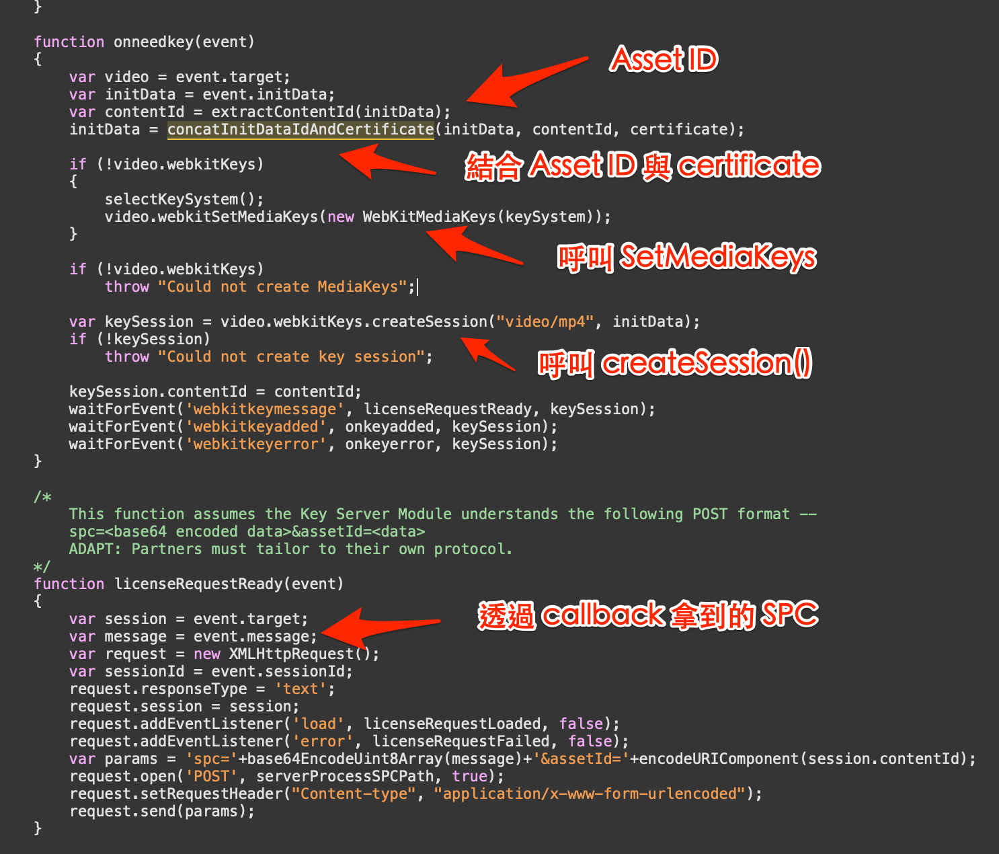

# HLS 與 FairPlay DRM

HLS 全名是 **HTTP Live Streaming**，是蘋果在 2009 年時所推出的網路直播技術—跟前面提到的 MP4 格式一樣，HLS 也不是只用在跟聲音有關的應用，我們不太應該把 HLS 當成是一種音檔，只是 HLS 的應用範圍也包括聲音的串流。

HLS 在 21 世紀第一個十年快要結束的時候推出，最大的意義就是，HLS 技術一口氣擴充了一場網路影片直播的同時人數上限。HLS 以及後來所推出的各種新格式，像是 MPEG-DASH 等，讓我們現在所習慣的萬人同時觀看直播，成為可能。

在 HLS 推出之前，在二十一世紀的第一個十年，主流的影片直播技術大概是 [Windows Media Server](https://en.wikipedia.org/wiki/Windows_Media_Services)、[Adobe Media Server](https://en.wikipedia.org/wiki/Adobe_Media_Server) 等，這些技術的最大共通性，是讓播放影片直播的 client 與 server 之間建立 socket 連線，中間使用像是 [MMS](https://en.wikipedia.org/wiki/Microsoft_Media_Server)、[RTMP](https://en.wikipedia.org/wiki/Real-Time_Messaging_Protocol)、[RTSP](https://en.wikipedia.org/wiki/Real_Time_Streaming_Protocol) …等協定溝通，server 不斷把最新的影音資料推送到各個 client 端，而單一 server 能夠接受的網路連線是有限的，所以，一場網路影片直播，最多大概上百人同時觀看，就已經到達極限。

HLS 改變 client/server 之間建立 socket 連線的架構，從 HLS 的名稱就可以看出，利用 HTTP 技術解決人數上限問題。在直播訊源與眾多觀看直播的 client 之間，多了幾個步驟：首先直播訊源會將資料編碼成 fMP4 （我們在下一章討論）格式之後，送到一台主機上，這台主機會把每隔一段時間（比方說，每隔 5 秒、10 秒…）的影片，轉成一個小檔案—這種將連續的資料變成一個個資料切片的程式，我們叫做 segmenter，每個被切出來的小檔案叫做 ts（[MPEG Transport Stream](https://zh.wikipedia.org/wiki/MPEG2-TS)，也是一種封裝格式，因為我們不太會去解析這套格式，就不解釋了），這些被切出來的小檔案會被佈署到 **[CDN](https://zh.wikipedia.org/wiki/%E5%85%A7%E5%AE%B9%E5%82%B3%E9%81%9E%E7%B6%B2%E8%B7%AF)** 上，另外產生一個文字檔，附檔名是 `.m3u8`，是這些小檔案的 playlist，指示 client 如何播放這些 ts，而當有新的 ts 被產生、佈署，這個 `.m3u8` 檔案也會隨之更新。

在 HLS 規格中，除了 TS 之外，[HLS 的切片也支援使用 fMP4 封裝](https://datatracker.ietf.org/doc/html/rfc8216#section-3.3)。但使用 fMP4 檔案封裝的 HLS 流，在多數平台都不被支援，[蘋果平台也僅在 macOS 10.12, iOS 10, tvOS 10 之後的版本才支援播放](https://developer.apple.com/documentation/http_live_streaming/about_the_ext-x-version_tag)。本章節後續均基於 TS 切片描述，[fMP4 檔將在 MPEG-DASH 章節介紹](../dash/#fmp4)。

以下圖片來自蘋果的 [HLS 技術官方頁面](https://developer.apple.com/documentation/http_live_streaming)：


Client 端在播放的時候，首先抓取 `.m3u8` 檔案，檢查當中有哪些 ts 檔案，在直播的狀況下，可能在 `.m3u8` 檔案中，就留了最新的三個 ts 檔，client 端就從第一個 ts 檔案開始輪流抓取、播放，在快要把這三個 ts 檔都快要播完的時候，就再去檢查一次 `.m3u8` 檔案，查看是不是還有更新的 ts 檔案，如果有，就繼續抓取這些新的 ts 檔。這個步驟就不斷的輪迴，直到發現沒有更新的 ts 檔案，代表直播已經結束。

由於檔案是佈署在 CDN 上，用戶也是從距離他最接近的 CDN 抓取檔案，而 Web server 所能夠負載的連線，遠大於單一讓眾多 client 建立 socket 連線的 server 。隨著 21 世紀第二個十年開始，幾大 CDN 廠商的業務規模擴張，CDN 技術愈來愈普及，像 [Akamai](https://www.akamai.com/) 這家 CDN 服務，大概在 HLS 問世時推出服務，隨著一起壯大，HLS 以及後來的新技術，也整個代替了之前的各種影片直播技術，HLS 也在 2017 年成為 [RFC 8216 規格](https://tools.ietf.org/html/rfc8216)。目前業界所使用的直播技術，大概都是 HLS 以及之後的其他新技術。

HLS 雖然最早用在直播，但之後也陸續應用在影片以及音檔的用途上。假如一個 `.m3u8` 檔案中的 ts 不會隨時間更新，而是靜態的，我們不是將直播訊號切成小檔，而是將一部電影或是影片的大檔切成小檔，那麼，這個 `.m3u8` 串流就可以是一部電影或是電視劇。而如果把靜態的 `.m3u8` 中的 ts，從影片再換成音檔，那也就是一個被切成眾多小檔案的歌曲串流了。

## 直播的延遲

雖然與我們跟音檔的相關討論比較沒有關係，不過我們可以來聊一下，在直播過程中會發生的延遲（latency）。細數一下從訊源到最後的收視端，我們可以發現，每一個步驟，都需要耗費時間處理，導致觀看者看到某個事件時，已經與事件實際發生的時間之間，有一段時間差：

- 負責錄影/錄音的設備，需要拍攝一定數量的影格/聲音（其實英文都是 frame），才有辦法累積成 packet，透過 RTMP 發送到負責切檔的主機
- RTMP 傳送資料到主機上的傳輸時間
- 主機需要累積一定數量的 packet，才能夠產生 ts。由於 HLS 支援多種不同品質的影像/聲音的 track，所以也往往會一次產生多個不同品質的 ts
- 將 ts 以及新的 `.m3u8` 檔案佈署到 CDN 上的時間
- 播放端 client 抓取 `.m3u8` 的時間
- 播放端 client 抓取 ts 檔案，到有足夠數量的 packet 可以播放的時間，這段時間也視用戶的頻寬品質而有所不同
- 因為 HTTP proxy 的 cache，用戶也可能抓到比較舊的檔案

所以，從事件發生，到用戶實際觀看到，往往會有大概 15 秒到半分鐘左右的延遲。蘋果在 2019 年 WWDC 時推出新的 [Low Latency HLS 規格](https://developer.apple.com/documentation/http_live_streaming/protocol_extension_for_low-latency_hls_preliminary_specification)，這個新規格用了一些技巧，想辦法減少直播過程當中的延遲，大概就是讓用戶盡可能去抓取最新的 ts，然後在 `.m3u8` 檔案中加上時間相關資訊，在抓到 ts 之後直接跳到最新的指定秒數，並且盡量不要被 proxy cache 所影響，可以參考 [WWDC 2019 年的說明](https://developer.apple.com/videos/play/wwdc2019/502/)。但這樣的 HLS server 的實作在現在（2020 年初）還不普及，播放端也需要最新的作業系統與播放軟體支援，要等到普及，相信還要花上一段時間。

## .m3u8 檔案

我們可以打開 Akamai 的一個[範例 m3u8 檔案](https://bitdash-a.akamaihd.net/content/MI201109210084_1/m3u8s/f08e80da-bf1d-4e3d-8899-f0f6155f6efa.m3u8)，看看裡頭的內容：

```
#EXTM3U
#EXT-X-VERSION:5

#EXT-X-MEDIA:TYPE=AUDIO,GROUP-ID="audio",NAME="English stereo",LANGUAGE="en",AUTOSELECT=YES,URI="f08e80da-bf1d-4e3d-8899-f0f6155f6efa_audio_1_stereo_128000.m3u8"

#EXT-X-STREAM-INF:BANDWIDTH=628000,CODECS="avc1.42c00d,mp4a.40.2",RESOLUTION=320x180,AUDIO="audio"
f08e80da-bf1d-4e3d-8899-f0f6155f6efa_video_180_250000.m3u8
#EXT-X-STREAM-INF:BANDWIDTH=928000,CODECS="avc1.42c00d,mp4a.40.2",RESOLUTION=480x270,AUDIO="audio"
f08e80da-bf1d-4e3d-8899-f0f6155f6efa_video_270_400000.m3u8
#EXT-X-STREAM-INF:BANDWIDTH=1728000,CODECS="avc1.42c00d,mp4a.40.2",RESOLUTION=640x360,AUDIO="audio"
f08e80da-bf1d-4e3d-8899-f0f6155f6efa_video_360_800000.m3u8
#EXT-X-STREAM-INF:BANDWIDTH=2528000,CODECS="avc1.42c00d,mp4a.40.2",RESOLUTION=960x540,AUDIO="audio"
f08e80da-bf1d-4e3d-8899-f0f6155f6efa_video_540_1200000.m3u8
#EXT-X-STREAM-INF:BANDWIDTH=4928000,CODECS="avc1.42c00d,mp4a.40.2",RESOLUTION=1280x720,AUDIO="audio"
f08e80da-bf1d-4e3d-8899-f0f6155f6efa_video_720_2400000.m3u8
#EXT-X-STREAM-INF:BANDWIDTH=9728000,CODECS="avc1.42c00d,mp4a.40.2",RESOLUTION=1920x1080,AUDIO="audio"
f08e80da-bf1d-4e3d-8899-f0f6155f6efa_video_1080_4800000.m3u8
```

這是一部影片的 `.m3u8` 檔案。每個 `.m3u8` 檔案以 `#EXTM3U` 開頭，然後接著一些基本的 metadata，像，這部影片裡頭用的語文是英文。

在這裡，我們可以看到，這份 HLS 串流支援多種不同的品質，影像解析度最低到 320x180、最高到 1080p（1920x1080）。client 端的播放器可以根據現在的頻寬品質，從多個不同品質的串流中，選擇目前最適合、能夠順暢播播放的最高品質，而當頻寬品質改變時，也會切換到另一個最適合的串流。這種可以動態使用最適合品質的串流播放方式，叫做 [Adaptive Streaming](<https://zh.wikipedia.org/wiki/%E8%87%AA%E9%81%A9%E6%80%A7%E4%B8%B2%E6%B5%81#Apple_HTTP_Live_Streaming_(HLS)>)。雖然有多種不同的影片格式，在聲音方面，則共用同一個 128k 的聲音 "f08e80da-bf1d-4e3d-8899-f0f6155f6efa_audio_1_stereo_128000.m3u8"。

然後我們可以看一下 [f08e80da-bf1d-4e3d-8899-f0f6155f6efa_video_180_250000.m3u8](https://bitdash-a.akamaihd.net/content/MI201109210084_1/m3u8s/f08e80da-bf1d-4e3d-8899-f0f6155f6efa_video_180_250000.m3u8) 這個影片相關的 `.m3u8` 檔案當中的內容：

```
#EXTM3U

#EXT-X-VERSION:3
#EXT-X-MEDIA-SEQUENCE:0
#EXT-X-TARGETDURATION:4

#EXTINF:4.0
../video/180_250000/hls/segment_0.ts
#EXTINF:4.0
../video/180_250000/hls/segment_1.ts
#EXTINF:4.0
../video/180_250000/hls/segment_2.ts
#EXTINF:4.0
../video/180_250000/hls/segment_3.ts
#EXTINF:4.0
../video/180_250000/hls/segment_4.ts
#EXTINF:4.0
../video/180_250000/hls/segment_5.ts
.....
```

當中就是一連串的 ts 檔案，在 `#EXTINF` 中，則描述了每個 ts 檔案的長度是 4.0 秒。

蘋果在 2016 年的時候宣布，除了可以將檔案切成 ts 之外，也可以支援 fMP4 格式的 byte range，如此一來，會讓 HLS 與後面要講到的 MPEG Dash 格式進一步相容。不過，我們也是留在下一章討論。

## 播放 HLS

HLS 格式是開放的，所以，除了蘋果的方案以外，第三方也可以自己實作 HLS 的 server、segmenter 與 client 端。

我們可以看到，目前有許多的影音托管服務，像是 [Wowza](https://www.wowza.com/) 等，可以幫想要播放內容的使用者產生 HLS 串流，也可以同時產生 MPEG Dash 等其他格式，如果上傳的是聲音訊號，也可以產生 shoutcast、icecast 形式的網路聲音廣播。

在播放軟體方面，蘋果官方的播放元件，自然是 AVPlayer。我們也可以看到一些第三方的實作，像是 [JWPlayer](https://www.jwplayer.com/)、[Kaltura Player](http://player.kaltura.com/docs/) 等等，都可以播放 HLS。但是能不能夠播放 FairPlay 保護的 HLS，就要看各家 Player 的支援程度。

由於 HLS 同時可以用在直播，或是播放線上的影片或是音樂，所以就會有兩種播放 HLS 的模式：在播放線上的影片或音樂的狀態下，我們可以任意跳到影片或音樂的任一位置，而播放軟體在跳到指定位置的時候，也只需要從 `.m3u8` 檔案中，找到符合時間位址的 ts 載入；至於在直播的模式下，由於我們只有少部分的 ts 可以使用，所以，播放器介面就往往呈現成「往前十秒」或「往後十秒」播放。


而在支援的音訊格式方面，TS container 並沒有限制當中的資料格式。所以，如果將 HLS 用在音訊的串流上，在 iOS/macOS 上，只要是 Core Audio 所支援的格式，包括 MP3、AAC、FLAC…，都可以使用 HLS 發佈。

## FairPlay Streaming

[FairPlay Streaming](https://developer.apple.com/streaming/fps/) 簡稱 FPS，是蘋果用來保護 HLS 串流的商用 DRM 機制。我們要解釋一下 FairPlay 與 FairPlay Streaming 這兩個名詞的差異，FairPlay 是一套蘋果用在各種產品上的 DRM 技術，像是 iTunes Store 上面購買的音樂、App Store 上購買的 app，蘋果都使用 FairPlay 保護，不過，只有用來保護 HLS 的 FPS，才從 2015 年起開放給外部使用。所以，當我們在蘋果外部講到 FairPlay，講的往往是 FPS。而即使蘋果開放外部使用，我們還是要額外跟蘋果申請以及簽約。

在一個受到 FPS 保護的 HLS 串流中，會把每個 ts 檔案加上 AES 加密，client 端要能夠播放，就必須要取得這把 key，FPS 的重點就是如何保證這把 key 在傳遞的過程中不會被外部破解。因為是被蘋果保護起來，所以我們也搞不清楚實際上蘋果做了什麼，根據蘋果的文件，我們只要照以下這麼做就對了：

> 找到 **Asset ID**，把 Asset ID 跟 **Certificate** 結合起來產生 **SPC**，傳到 server 上，如果可以從 server 成功拿到 **CKC**，把 CKC 塞進播放元件，就可以播了。

…這一段話裡頭充滿了許多奇妙的關鍵字，像是 SPC、CKC…一定要解釋一下才有辦法理解。我們在下面會解釋一下在 iOS/macOS app 上的流程。當中不會講解太多實際在平台上會呼叫哪些 API，但是至少得解釋像 CKC、SPC 這些關鍵字，才有辦法了解 FPS。

## 處理 FairPlay Streaming 的流程

### 先從 .m3u8 中解析出 asset ID

一個被 FairPlay 保護起來的 .m3u8 檔案，裡頭會有像這樣的一段：

```
#EXTM3U
....
#EXT-X-KEY:METHOD=SAMPLE-AES,URI="skd://f3c5e0361e6654b28f8049c778b23946+5c3de6de8c2bb1295712e8da387add37",KEYFORMATVERSIONS="1",KEYFORMAT="com.apple.streamingkeydelivery"
```

"f3c5e0361e6654b28f8049c778b23946+5c3de6de8c2bb1295712e8da387add37" 這一段，就是一個 asset ID，是 FairPlay 機制當中用來表示一個特定媒體，像是特定影片、歌曲的方式。在播放一個 HLS 串流，播放器就會嘗試去尋找是否有這段資訊，如果沒有，就代表沒有加上保護，播放元件就會直接播放這個 HLS 串流。

在 iOS/macOS app 中，我們會先把 `.m3u8` 串流放在一個 AVAsset 中，在嘗試載入這個 AVAsset 的時候，如果遇到被保護、需要 Key 的 HLS，就會觸發對應的 delegate method。在 Safari 瀏覽器中，我們可以對 video tag 的 "webkitneedkey" 事件加上 listener，然後，這個 video tag 播放的影片需要有一把 Key 時，就會觸發後續的行為。

### 產生、上傳 SPC，取得 CKC

SPC 全名叫做 Server Playback Context，簡單來說，就是用兩種來源的資料，透過蘋果的一套被保護起來的演算法，產生出來的授權需求資料，我們往 server 上傳這份資料之後，就可以拿到最後可以用來播放的 key—不過，這把 Key 也是被保護起來的，這個把 Key 包起來的資料，叫做 CKC，Content Key Context。

我們在通過蘋果的審核，可以開始使用 FairPlay 之後，我們可以在蘋果的開發者後台上建立一份 FPS 使用的 Certificate，因為我們可以隨時更新這份 certificate，所以不太應該直接放在 client 端，而是應該放在一個 Web API 上，讓 client 端在有需要的時候抓取。

在 iOS/macOS 平台上，我們接下來要呼叫 AVAssetResourceLoadingRequest 的 [streamingContentKeyRequestData(forApp:contentIdentifier:options:)](https://developer.apple.com/documentation/avfoundation/avassetresourceloadingrequest/1386116-streamingcontentkeyrequestdata)，這邊 `forApp:` 要傳入的，就是上面提到的 certificate，contentIdentifier 則是 asset ID；這個 API 回傳的資料，就是 SPC。至於這個 method 後面做了什麼事情，沒有人知道。

在 Safari 瀏覽器中，在 webkitneedkey 被呼叫的時候，則要結合 asset ID 與 certificate，呼叫 video tag 的[webkitSetMediaKeys](https://developer.apple.com/documentation/webkitjs/htmlmediaelement/1633293-webkitsetmediakeys)，以及 [WebKitMediaKeys](https://developer.apple.com/documentation/webkitjs/webkitmediakeys) 的 [createSession](https://developer.apple.com/documentation/webkitjs/webkitmediakeys/2871278-createsession) 。呼叫方式，可以參考 FPS SDK （可以從蘋果[官網](https://developer.apple.com/streaming/fps/)下載）中的範例程式：



我們的 Server 需要準備另外一支 Web API，這支 API 後面，要橋接蘋果在 FairPlay SDK 裡頭的 Key Server Module，拿蘋果的 library 來處理 client 端上傳的 SPC，回傳的結果，就是 CKC，把 CKC 塞到 Player 上（在 iOS/macOS app 中，呼叫 [AVAssetResourceLoadingDataRequest](https://developer.apple.com/documentation/avfoundation/avassetresourceloadingdatarequest) 的 [respond(with:)](https://developer.apple.com/documentation/avfoundation/avassetresourceloadingdatarequest/1390581-respond)）；至於在 Safari 瀏覽器中，則是呼叫 [WebKitMediaKeySession](https://developer.apple.com/documentation/webkitjs/webkitmediakeysession) 的 [update](https://developer.apple.com/documentation/webkitjs/webkitmediakeysession/2870997-update)。

換句話說，一個完整的 FairPlay server 應該要有兩個 API end point：1. 下載 certificate、2. 驗證 SPC 並回傳 CKC。

## FairPlay Streaming 近年的演變

蘋果在 2015 年釋出公開版本的 FPS 時，只提供在播放的過程中抓取 CKC 的流程，之後，蘋果也陸續擴充 FPS，在每年的 WWDC 公布更多 FPS 的新功能。這些新功能都在 ios/macOS 的 app 端，在 Web 上，

### WWDC 2016 - Offline HLS

蘋果在 2016 年推出 Offline HLS，可以讓第三方廠商在自己的 app 中，將 HLS 串流下載到本地端離線播放，而 HLS 的 Key 也分成了兩種，一種是播放用的（Streaming Key）、另外一種是離線儲存用的（Persistent Key）。與 Offline HLS 的相關資訊參見 [What's New in HTTP Live Streaming](https://developer.apple.com/videos/play/wwdc2016/504/)。

### WWDC 2017 - Content Key Session

蘋果在 2017 年推出 Content Key Session，把抓取 CKC 的流程，與播放流程區分開來。

這個設計在於解決幾個問題：

- 如果某個直播活動會在某個時間開播，當直播開始之後，就會有大批的用戶湧入，當所有用戶都同時跟 server 要求 CKC 的時候，就會產生很大的瞬間流量。所以，我們就希望可以在活動開播之前，用戶就完成 DRM 的驗證流程，拿到 CKC，而不要到了開播之後才做。
- 在 2016 年推出 Offline HLS 之後，可以設定一份 Offline HLS 在固定時間過期，但是在過期之後，原本的機制，只能夠在用戶重新播放的時候更新離線憑證，不能事先讓用戶知道已經過期，使用體驗並不友善。

Content Key Session 獨立於播放元件之外，可以讓第三方廠商，可以在適當的時機，就抓取、更新 CKC；此外蘋果增加了 HEVC 影像格式支援、IMSC1 字幕、新的下載管理員元件…等。參見 [Advances in HTTP Live Streaming](https://developer.apple.com/videos/play/wwdc2017/504/)。

跟 Content Key Session 有關的部分，也可以參見 WWDC 2018 的 [AVContentKeySession Best Practices](https://developer.apple.com/videos/play/wwdc2018/507)

### WWDC 2019 - Low Latency HLS

如前所述，蘋果推出 Low Latency HLS 規格，嘗試降低 HLS 的延遲時間。

## 使用 HLS/FairPlay Streaming 的優缺點

HLS/FairPlay Streaming 是在 iOS/macOS/tvOS 等蘋果平台，以及 Safari 瀏覽器中播放直播串流—尤其是受保護的串流—的首選，我們直接享受平台官方的套件以及支援服務。

但，用來播放 HLS 的元件，其實是設計給影片，而不是設計給音樂服務用的—如果只是 HLS，我們還有一些其他選擇，但如果要播放 FairPlay DRM 保護的內容，就只有 AVPlayer 等官方的元件—影片播放軟體並不會考慮一些音樂播放的特殊情境，像是一些特殊的迴音、等化器效果，或是會讓兩首歌曲重疊的淡入淡出效果—沒有人會把兩部電影放在一起混音播放，但是在音樂上卻是非常常見的情境。

拿 HLS 實作音樂播放，就得同我們要捨棄這些音訊效果，如果我們是打造一套全新的服務，可能還可以從一開始就不打算支援；但如果一套產品上線已久，這些效果，是已經存在的產品功能，那是否應該改用 AVPlayer 以及 HLS 這一整套技術，就得要做全盤的評估。

另外，就是 Offline HLS 的離線播放授權憑證更新機制。每部 HLS 下載之後，都有各自的 CKC，在更新憑證的時候，也要一部一部影片各自更新。由於這些機制主要為了影片而設計，線上影視服務的用戶，大概只會下載一定數量的影片，而且往往看過一次就刪除，用戶往往會重複播放相同的音樂，但很少重複觀看相同的電影。如果拿 Offline HLS 做音樂服務的離線下載功能，我們也可以預期，如果用戶下載了大量歌曲，使用體驗可能並不理想。

而這整套技術，都與蘋果的生態系綁得非常緊密，如果要在其他平台上使用商用 DRM 保護內容，往往還是得挑選其他的方案。
