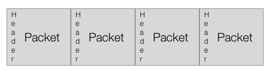
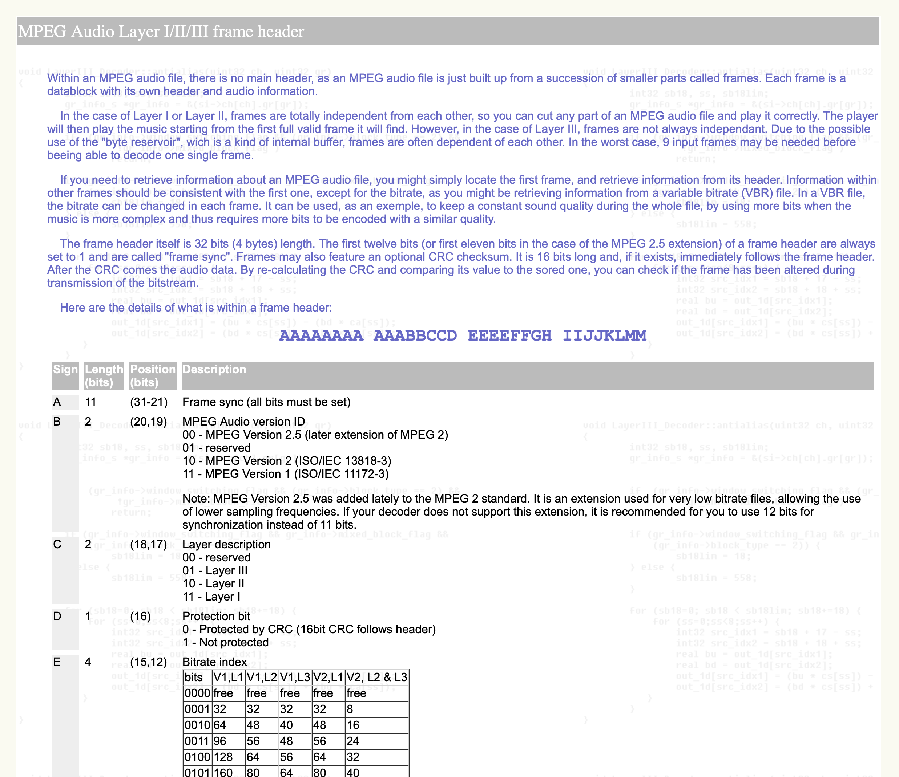
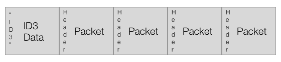
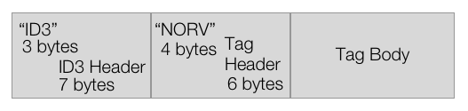
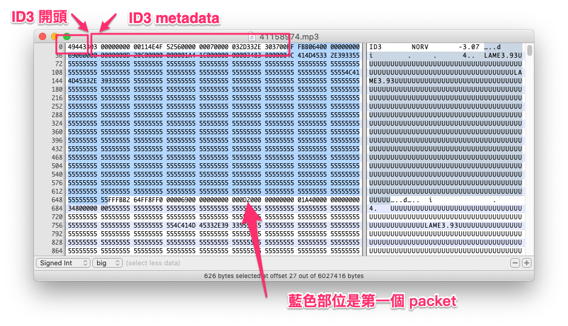

# MP3 格式

Internet 在上個世紀 90 年代開始普及。一首錄製在 CD 上的三分鐘長度的歌曲，大概就要 30mb，以那個時代的頻寬來說，傳遞這樣的檔案是非常吃力的事情。

但是，在 MP3 格式出現之後，一首 30mb 大小的歌曲變成了 3mb 大小，變成可以方便地在網路上傳佈，於是，無論是用戶在非法 P2P 軟體上大量散佈、傳遞 MP3，或是後來出現透過網路購買音檔的音樂商店，甚至更後來出現了月費制音樂服務、甚至是 Freemium 商業模式，MP3 都整個改變了音樂產業以及整個世界。

我們在這邊略過 MP3 的歷史，MP3 如何成為規格，以及音樂產業發生的變化，只討論 MP3 是怎樣的格式，以及工程師可以如何處理 MP3 檔案。

MP3 是一種壓縮格式，於是讓檔案變小，更精確來說，是一種破壞式壓縮檔案，在壓縮地過程中，會捨棄掉一些發明這個格式時、覺得可以捨棄掉的部份，如果我們把 CD 上的歌曲轉成 MP3，雖然還是有辦法可以再轉換回 CD 格式的 PCM 檔案，但這樣的檔案已經跟原本的檔案不同了。

## Bit Rate

**Bit rate** 在中文很多時候叫做比特率，描述的是壓縮音檔被壓縮到什麼程度，單位是 bps（bits per seconds，一秒的音訊需要多少 bit）。

我們常見所謂 128k、192k、320k 這些單位，意思是，一秒鐘的壓縮音檔，會需要用到多少 bit 的資料，以 128k 來說，就是一秒鐘有 128 k 的 bit，如果我們想要換算成 byte，就是 128 \* 1024 / 8（一個 byte 有 8 個 bit），我們可以得到 16,384 bytes，因此我們可以算出，如果是一首三分鐘的歌曲，在固定碼率的狀況，檔案大小就在 3mb 左右（128 \* 1024 / 8 \* 3 \* 60 = 2949120）。

在壓縮過程中，還有所謂的**變動碼率**（ VBR，Variable Bit Rate）與**固定碼率**（ CBR，Constant Bit Rate）。如果某個 packet 當中出現的數字都非常近似，像是這個 packet 中的聲音都是靜音的，那麼，我們就有機會可以把這個 packet 壓縮得更小，於是，我們就可以把整個 MP3 檔案壓縮得更小，而每個 packet 的大小則不一，這就是變動碼率。如果我們關閉這種行為，讓每個 packet 的大小固定，就是固定碼率。

## Packet、以及 MP3 檔案的長度

在將 PCM 編碼成 MP3 格式的時候，我們並不是直接壓縮整個檔案，而是先將連續的 Binary Data 切成許多小塊的資料，把一小塊、一小塊的資料壓縮起來之後，再把壓縮後的資料連接起來。用來對這樣小塊資料做壓縮/解壓縮的程式，叫做 **codec**，每一個小塊的單位，叫做 packet（通常在台灣稱呼 packet 為封包）。或這麼說：codec 就是負責壓縮/解壓縮 packet 的程式。

在 MP3 格式中，每個 packet 當中，通常會有 1152 個採樣（其實也可能會有 384 或 576 這樣的採樣數字，但實在很少用到），如此一來，就往往會遇到必須要在最後一個 packet 中，透過填入 0 補足 packet 長度的情形，另外，許多的 encoder 也會在檔案的前後補上一些靜音的採樣（像 LAME 這個 encoder 就是如此，參見 LAME 的[說明](https://lame.sourceforge.io/tech-FAQ.txt)）。因此，我們要有一個重要的觀念：**當我們在轉換音檔格式的時候，音檔的長度是會改變的**。

以 CD 音質來說，由於一秒鐘有 44100 個採樣，也就代表，這個檔案中的最小時間單位是 1/44100 秒，而 MP3 格式的最小時間單位則是 1152/44100 秒；假使我們現在有一個剛好一秒鐘的 PCM 檔案，想要轉換成 MP3 格式，44100/1152 是 38.28125，如果我們想要完整包含這一秒的資料，MP3 格式就得用到 39 個 packet，但是第 39 個 packet 得在後面補上零，而轉出來的 MP3 也不會是一秒鐘，而是 1.0187755102 秒。

Client 端的 player 在播放 MP3 時，不用把這個檔案全部抓下來，只要累積一定長度的資料，認為這個長度足夠順暢播放，就會開始播放。計算的方式就是看累積了多少 packet：從上面那個例子，就可以知道，如果 Player 找到了 39 個 packet，就可以算出，這個檔案有大概一秒左右的資料；如果 client 端覺得，有了五秒鐘左右的資料，就可以播放，那就可以開始將 MP3 轉換成 PCM 播放。如果網路有點卡頓，造成某段資料播放完畢，但是等不到接下來的資料，這時候 player 就會進入所謂 **stall** 的狀態：player 會先暫停，等到繼續累積到夠多的 packet，才接續播放。

而想要知道一首 MP3 歌曲有多長，就是把這個檔案讀過一次，找出這個檔案有多少 packet，然後用 packet 的數量算出時間。

所以，原本是同一首歌曲，經過轉檔之後，在不同格式下的長度是不同的，所以，如果你在經營音樂服務，想要統計用戶對一首歌曲到底播放了多少時間，也必須把這些差異考慮進去，即使用戶播放的是同一首歌曲，但因為選擇了不同的格式，最後回報的播放長度，也還是會有毫秒等級的差別。比方說，如果你同時提供一首歌曲的 MP3 與 AAC 版本，在 AAC 格式中，一個 packet 的大小是 1024，所以，MP3 與 AAC 格式的長度就是不同的。

以圖形表示 MP3 格式，大概會像這樣：

## MP3 Frame Header

一個 MP3 檔案中，所包含的是連續的 Binary Data，不過，在我們編製 MP3 檔案的時候，會在每個 packet 前方加上一小段 header，由於這種 header 有明顯的特徵，Player 只要找到 header，就可以知道哪裡是 packet 的開頭與結尾，把 packet 資料抽出來，交給 codec 解壓縮，轉成 PCM 格式，之後就可以交給作業系統的音訊 API 播放。

每個 header 的長度為 4 個 bytes，最大的特色是前 11 個 bit 都是 1，這一段叫做 **Syncword**。找到 syncword 之後，就可以繼續把後面的 bit 都讀完，就可以得到 Mpeg Audio 版本（在 MP3 之前還有 MP1、MP2 兩種格式，但是並不流行，但是 MP3 Header 還是把這個版本列入規格中）、壓縮後的 bitrate…等等資訊。

如果我們打開 MP3 header 的[規格書](http://www.mp3-tech.org/programmer/frame_header.html)，會看到一串「AAAAAAAA AAABBCCD EEEEFFGH IIJJKLMM」像是天書的文字，我們不要被嚇到，這串文字代表的是這 4 個 bytes、32 個 bit 中、每個 bit 的用途。像是一開頭的 11 的 A，就是我們上面講到的 syncword。

用來將 header、packet 從連續的 Binary Data 找出來的程式，叫做 **Parser**。對於有處理過 Binary Data 的工程師來說，都有辦法可以自己撰寫出 MP3 Parser，至於 MP3 codec 則很長時間受到權利保護，一般工程師也沒什麼機會直接接觸 codec。而在像是 macOS 或 iOS 等蘋果的平台上，蘋果只提供我們 decode MP3 的 codec，而沒有 encode MP3 的 codec。

## ID3

MP3 格式本身只有定義聲音資料的部份，但很多時候，我們需要一些關於音檔的額外描述資料，像是這種歌的歌名，歌手是誰、出自哪張專輯、屬於哪種樂風…也就是英文所稱的 metadata，並沒有包含在 MP3 格式的規範裡。我們所使用的音檔播放軟體，像是 iTunes（在 macOS 10.15 之後改名 Music）、VLC 等等，之所以可以從檔案中知道這些資訊，則是透過 [ID3](https://en.wikipedia.org/wiki/ID3) 格式。

ID3 metadata 也是一連串的 binary data，目前比較通行的是第二版的 ID3v2，會出現在整個 MP3 檔案最前面的位置。ID3 資料的，前三個 bytes 就是 "ID3" 這三個字元的 ASCII code。在讀取 MP3 檔案的時候，只要一開始就讀到這三個字，就可以判斷這個檔案有 ID3 資訊；接著，我們就來處理正段資料的前 10 個 bytes，在這 10 個 bytes 中，除了 "ID3" 這三個字之外，還包含了這是那個版本的 ID3，以及整段 ID3 資料區段的長度有多少等資訊…我們就一直讀到這個長度範圍。

有一點需要注意，ID3 格式中，是用 28 位元不帶正負號整數（UInt28），描述 ID3 資料的長度。28 位元整數這個規格有點奇妙，總長度其實也是 4 個 bytes，但是每個 byte 的第一個 bit 要捨棄掉，然後，用這四個 bytes 的剩下 7 個 bit，組合出一個整數。

從第 11 個 byte 開始，我們就可以讀出一個個的 ID3 frame，每個 ID3 frame 也是由 header 與 body 組成，在 header 中可以讀出這個 frame 代表什麼、以及 body 的長度，body 則是實際的內容，像是歌名、歌手…等：

- 每次先讀 10 個 bytes
  - 前 4 個 bytes 是 Tag ID，像 `TALB` 就是專輯名稱、`TCOM` 是作曲者…
  - 5-8 這 4 個 bytes 是 frame body 的長度，也是 28 位元無正負號整數
  - 2 個 bytes 的 padding
- 然後根據 header 中的 frame body 長度，往下讀取
  - frame body 的第一個 byte，代表的是這個資訊使用的字元編碼方式
    - 0：ASCII
    - 1：UTF-16-LE
    - 2：UTF-18-BE
    - 3：UTF-8

每段資料的長度如下圖：

我們也可以參考 ID3 網站上的[規格](http://id3.org/id3v2.3.0)。

我們可以用 Hex Editor 打開一個 MP3 檔案，就可以發現我們所講到的重點：

- 我們可以看到，這個 MP3 檔案的開頭是 "ID3"，代表包含了 ID3 資訊
- 由於 syncword 是連續 11 個 1，所以我們去找 "FFFB"，就可以找到 packet 的開頭
- 這裡的第一個 packet，其實是 LAME 加上去的靜音 packet

## MP3 格式的優缺點

每個 packet 前面都有一個檔頭，同時是 MP3 格式的優點與缺點。好處是，如果播放軟體透過網路，接受到了一段連續的 MP3 資料，只要播放器從資料中發現一個 syncword，就可以找到 packet 並且開始播放，而如果因為網路傳輸問題，造成某一資料遺失，那麼，一樣只要繼續往下讀取，找到 syncword，就可以恢復播放。

MP3 格式的這種特性，在 90 年代造就了像是 [shoutcast](https://www.shoutcast.com/) 這樣的網路廣播電台。Shoutcast 技術讓 client 與 server 之間建立 socket 連線，server 不斷向 client 端傳送連續的 MP3 資料，client 端一開始連上時，並不認得最前面的一些 bytes，但只要讀到第一個 syncword，就可以讓用戶開始享受網路廣播。

但，如果我們想要知道一個 MP3 音檔的實際長度，以及像是播放位置一分零三秒會對應到檔案的哪個位置，MP3 就不是很有效率的格式。我們想要知道總長度，就得把整個檔案讀取一次，才有辦法知道總共有多少 packet，我們也得讀取了一分零三秒的資料，才有辦法要求播放軟體 seek 到一分零三秒播放。

比方說，我們有一個放在 web server 上的 MP3 音檔，我們想要在播放這個檔案的時候，直接從一分零三秒開始播放，更有效率的方式是，如果我們可以一開始就知道一分零三秒是整個檔案的第幾個 byte，我們就直接帶了 [Range HTTP Header](https://developer.mozilla.org/en-US/docs/Web/HTTP/Range_requests) 的 HTTP 連線，直接從那個位置開始抓檔，Server 就會回應 HTTP status code 為 [206](https://developer.mozilla.org/zh-TW/docs/Web/HTTP/Status/206) 的回應，只給我們那一段資料，省去載入前一分多鐘的時間。

那麼，我們有什麼辦法可以知道一分零三秒到底在檔案的哪裡？如果是固定碼率的檔案，我們大概還有辦法推算，但如果是變動碼率呢？

於是，我們發現，在 MP3 之後的許多檔案格式，是讓 codec 與 **container** （中文通常叫「容器」，但習慣上還是直接講英文）分家的。codec 負責的是 packet 的壓縮/解壓縮，而 container 則負責安排 packet 與 packet 的 header 的擺放方式，像 AAC 音檔就有多種不同的 container 格式。在蘋果的平台上，通常把 codec 格式叫做 audio format、把 container 叫做 file format。

## 改變 Bit Rate 會改變 Sample Rate 嗎？

之前有個同事有點把 Bit Rate 與 Sample Rate 搞混了，所以問我，MP3 明明就會把檔案壓小，為什麼壓縮之後，Sample Rate 並沒有改變？我就舉了一個圖檔的例子。

如果你有一張 1920 x 1080 解析度的圖檔，在儲存成 JPEG 圖形的時候，各種修圖軟體或是轉檔軟體，會詢問你要怎樣的比例，如果你想要把圖檔壓縮得越小，那麼壓縮之後的圖片就會越失真，但不管你怎麼壓縮，你重新打開這一張圖檔，解析度仍然是 1920 x 1080。音檔也是同樣的道理，對於 MP3 這些格式來說，不管你把音檔壓縮得多小，最後 codec 把壓縮音檔還原成原始 PCM 格式的時候，還是一樣的 Sample Rate。

而改變 Sample Rate 這件事情，也比較像是你把一張 1920 x 1080 的圖片轉成 1280 x 720 的圖檔。
