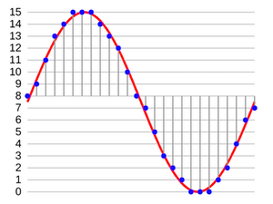

# PCM 格式

## 數位與類比

聲音是人耳可以感受到的、空氣中與水中的震動，是一種類比（Analog）訊號，音檔則是用數位（Digital）的方式將這些震動記錄下來。

人體可以從大自然中感受到的訊號，都是類比訊號—所謂類比訊號，是在訊號中存在著相對的強弱的位比，而數位訊號則是由位元組成，是絕對的 0 與 1，用 0 與 1 所組成的數字，盡可能地描述與還原曾經發生在大自然中的類比訊號。

以顏色來說，大自然中並不會有絕對的白、也不會有絕對的黑，不會有完全無光或是光線數量的極限狀態，以聲音來說，也不會有完全的無聲，或是聲音的極限狀態。

但因為電腦的容量與算力的關係，在電腦上，我們必須訂出一個數值的上限與下限。在大自然當中有無數種色彩，但是我們在電腦上，以 RGB 來說，就是 256 \* 256 \* 256 所組成的、將近一六七七萬種顏色。

當我們想要把大自然當中的類比訊號轉換成數位訊號的時候，我們就只能夠記錄實際發生在大自然當中的部份訊號，而我們記錄的是人體的感官所能夠感受到的範圍。

類比信號才是人類最後可以感受到的信號，即使我們轉換了數位音檔，還是必須透過耳機或是喇叭等硬體播放出來。我們需要數位音檔的原因是—類比訊號往往無法傳遞到遠方，人聲往往傳遞不過幾十到幾百公尺，但我們希望可以將聲音傳送到更遠的地方；聲音會經過一段時間之後消失，但我們希望可以在事件發生之後，仍然可以重現當時的訊號。但，記錄的過程，也同時是失真的過程—一定會有些片段或事物，在轉換、傳遞的過程當中遺失。

## 採樣

用來偵測空氣中的震動的裝置，我們都知道，那就是麥克風。那麼，在電腦上，會被以什麼方式記錄？

聲音是波，在數學上，如果我們想要描述一個波，會使用二元方程式表達，以 X 軸代表時間，以 Y 軸代表聲波的震動，理論上我們可以將時間分割成無限小，而現實中，物理上時間還是會有一個最小的單位，而我們在電腦上，也沒辦法將時間分割到非常小的單位，所以數位音檔勢必要將這個連續的波型，根據一個合理的時間刻度，在這個時間刻度上，標上一連串、一個又一個的數字。

將連續的波型變成一連串的數字，這個過程叫做**採樣**（Sampling，也稱作取樣，可以參見 [Wikipedia 上的說明](https://zh.wikipedia.org/wiki/取樣)），每一個被採集出來的數字，在中文也叫做採樣（Sample）—英文中很多單字的動詞與名詞是兩個字，但是在中文往往會變成同一個詞，在台灣，也比較常直接講英文。

一個波型，有振幅與頻率這兩種性質，在採樣的過程中，我們只擷取一定範圍的振幅與頻率之間的聲音。採樣的過程，其實也就是一種捨棄的過程：

- 一個聲波的上下起伏，代表的是聲音的音量大小，波型的密集程度，則代表聲音的音高，如果波型越密集就代表這個聲音愈高，反之則愈低。音量的單位是**分貝（dB）**，人耳可以聽到的音量在於 0 到 100 分貝之間，超過 100 分貝，就會超過人耳可以忍受的程度，超過 100 分貝的聲音，在採樣過程中，就會被當成 100 分貝處理。
- 人耳大概可以聽到頻率為 22050 Hz （意思是在 1/22050 秒中產生的波型），而如果將頻率乘上兩倍，變成 44100，根據[採樣定理](https://zh.wikipedia.org/wiki/%E9%87%87%E6%A0%B7%E5%AE%9A%E7%90%86)，人耳就聽不出差異。不過，近幾年的高音質音檔、以及所謂的 DVD 音質，也用到了像是 48000、96000 這樣的頻率。

我們所謂的 **[採樣率](https://zh.wikipedia.org/wiki/%E9%87%87%E6%A0%B7%E7%8E%87)**（Sample Rate，也稱採樣比、取樣率…等）：就是在一秒鐘當中，我們採集了多少個數字，所謂 44100 的採樣率，就是一秒鐘採集 44100 個數字。

我們往往會採集左右兩個**聲道**（Channel），以創造立體聲的效果。所以在一組立體聲的採樣中，會有兩個數字，兩個聲道的數字會用 LRLR…這樣的左右並排方式排列，這種一左一右排列採樣的方式，我們叫做 Interleave。當我們在計算檔案大小的時候，還需要從 Sample Rate 再乘上 2，把左右聲道兩個 Sample 合併在一起，就是一個 frame。

在某些格式中，可以允許更多的聲道，像 FLAC 就支援到八聲道，而像所謂 5.1 聲道、7.1 聲道…都不只 2 聲道。

電腦有各種表達數字的方式，而由於聲波會上下震盪，所以我們需要用帶正負號的數字來表達往上與往下的起伏，常用到的數字格式包括 16 位元整數（singed int 16）、32 位元整數（signed int 32）、32 位元浮點數（float 32）…等。對許多自已透過數學產生電腦波型的工程師來說，往往會使用 32 位元浮點數（採樣數字介於 1.0 到 -1.0），撰寫各種聲音處理的演算法，在 CD 上是使用 16 位元整數（採樣數字介於正負 2 的 15 次方），用兩個 byte 儲存一個採樣。

至於目前許多高音質格式用的是 24 bit，代表用 3 個 bytes 儲存一個數字，不過，一般寫程式通常不會用到這種數字，所以實際使用上，會把 24 bit 整數再轉換成 32 bit 整數或是浮點數。

## PCM 格式—所謂的原始音檔

這種以一連串數字描述聲音的格式，我們往往叫做原始音檔，而術語叫做 **[PCM 格式](https://zh.wikipedia.org/wiki/%E8%84%88%E8%A1%9D%E7%B7%A8%E7%A2%BC%E8%AA%BF%E8%AE%8A)**（**Pulse-code modulation**，中文叫做「脈衝編碼調變」，但是很少人可以記住這個中文名稱，通常就慣稱 PCM）。像微軟 Windows 上的 [WAV 檔案](https://zh.wikipedia.org/wiki/WAV)（用「錄音機」軟體錄製出來的聲音檔案）、蘋果平台上的 [AIFF 檔案](https://en.wikipedia.org/wiki/Audio_Interchange_File_Format)，都屬於這種格式，只是通常都還會在最前方加個檔頭。而從上面的描述，我們也可以知道，雖然同樣叫做 PCM 格式，但是可能會有不同的 Sample Rate、或是用不同的數字格式描述波型，而 WAV、AIFF 檔案的檔頭，用是用來告訴播放軟體應該怎麼解析檔頭之後的資料。

現在用戶通常很少會直接播放 PCM 檔案，在網路上流通的音檔，也很少會是 PCM 格式，但無論是哪種格式，在 client 端最後都得要轉換成 PCM 格式，才能夠再交給 client 端的硬體播放：有可能是透過平台本身已經包好的播放器元件，像 iOS/macOS 平台上有高階的播放器 AVPlayer，也可能是要使用更低階的 Audio API，自己想辦法呼叫 codec，將各種格式轉換成 PCM 格式。

而如果想要用一些聲音剪輯或編輯軟體，像 [Audacity](https://www.audacityteam.org/)，處理一段錄好的聲音，也需要轉換成 PCM。比方說，我們想要編輯一個 MP3 檔案，Audacity 會先轉成 PCM 格式讓我們編輯，在存檔的時候，再把 PCM 轉回 MP3。另外，在使用 Audacity 的時候，可以注意到有一項 "Import->Raw Data" 的功能，就是用來匯入沒有檔頭的 PCM 資料，而由於沒有檔頭，就必須手動填入聲道數量、sample rate 等…。

## 音訊處理

一般在講數位音訊處理的書籍或文件，接下來往往會講怎樣製作各種聲音效果，像是怎樣對聲音訊號做[傅立葉轉換](https://zh.wikipedia.org/wiki/%E5%82%85%E9%87%8C%E5%8F%B6%E5%8F%98%E6%8D%A2)（Fourier Transform），以及怎樣用程式產生波型，像是 sine wave、sawtooth wave…進而打造屬於自己的數位樂器，等等。

在這邊，我們主要講解各種格式的檔案，所以並不討論這部份（其實我自己對這方面也不怎麼了解），不過，我們需要知道：如果要產生改變聲音本身的各種效果，像是 [EQ 等化器](https://zh.wikipedia.org/wiki/%E7%AD%89%E5%8C%96%E5%99%A8)、迴音、[殘響](https://en.wikipedia.org/wiki/Reverberation)或立體聲效果等，都是透過改變波型達成的，而如果我們想要在 UI 上顯示[頻譜圖](https://zh.wikipedia.org/wiki/%E9%A2%91%E8%B0%B1)，也是先讀取 PCM 訊號，然後繪製出轉換後的結果。

也就是說，如果我們選擇了某種音檔格式，這種格式只能夠用特定的播放器播放，讓我們無法直接碰觸到 PCM 格式的資料，我們就無法達到上述的這些效果。比方說，我們打算使用一些經過商用 DRM 保護的格式，像是經過蘋果 FairPlay 保護的 HLS、或是 Google 的 Widevine 保護的 Dash 串流，這些串流格式就只能夠用特定播放器播放，如果還想要加上 DTS 立體聲效果，就是完全衝突的。或許某些播放元件提供給我們一些選項，但只要不能夠碰到 PCM 格式的資料，我們能夠對聲音效果的客製都是有限的。

## CD 音質、Hi-Res Audio

我們所謂的 **CD 音質，就是用 44100 的採樣率、有左右聲道的 16 位元整數（Sint16）**，所以我們可以預估，一秒鐘的資料量就是 44100 \* 2 \* 2 = 176400 ，一分鐘就需要 10mb 左右，一張 CD 有 640mb 的容量，所以就可以算出一張 CD 可以容納大約 63 分鐘的聲音資料（640 \* 1024 \* 1024) / (44100 \* 2 \* 2 \* 60) ，大約 63.4）。這也是長久以來數位音樂的標準。

我們常常說近年來的一些訂閱制音樂服務是「數位音樂」，不過，CD 就已經是數位音樂了，CD 也創造了一個輝煌的唱片銷售時代。

此外還有以下常見的音質標準

- 電話音質：11,025 Hz, 8bits, 單聲道
- 收音機音質：22,050 Hz, 8bits, 單聲道
- DVD 音質：96,000 Hz, 24bits 雙聲道

至於所謂的 [Hi Res Audio](https://en.wikipedia.org/wiki/High-resolution_audio)，其實定義很混亂，基本上意義就是 CD 音質以上的檔案，通常是指 96k 或 192k Hz 採樣比的音檔。

更高的採樣比意味著音質的提升，不過，但對於很多用戶來說，如果只是使用一般的耳機設備，其實聽不出更高採樣比有什麼差別，而且很多現在流行的藍芽無線耳機（如蘋果的 Air Pod），在透過藍芽傳遞音訊時，為了讓藍芽傳輸順暢，還會做過轉檔、重新轉成特定採樣比的資料，把高音質的檔案轉成普通的音質播放。
