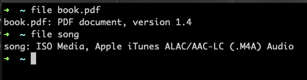
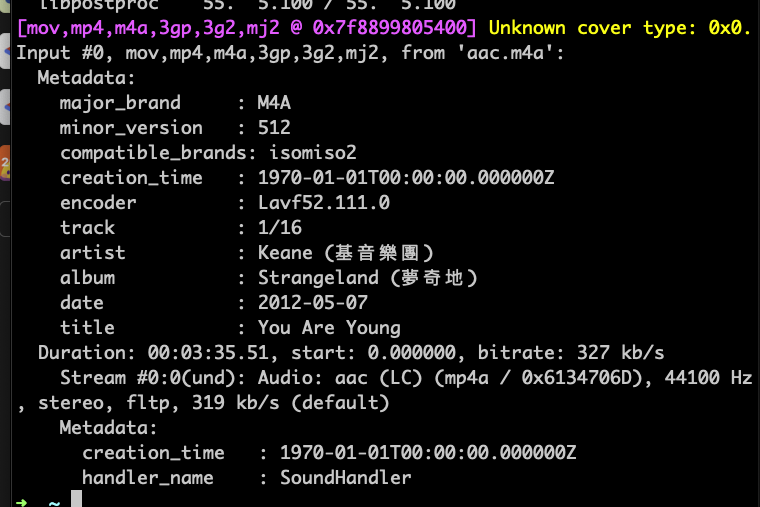
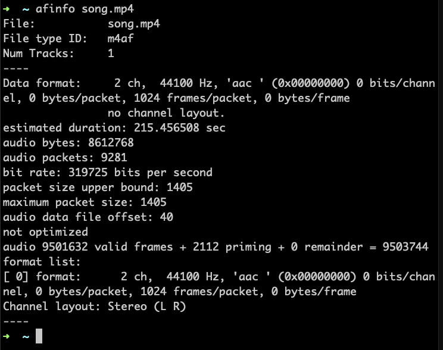
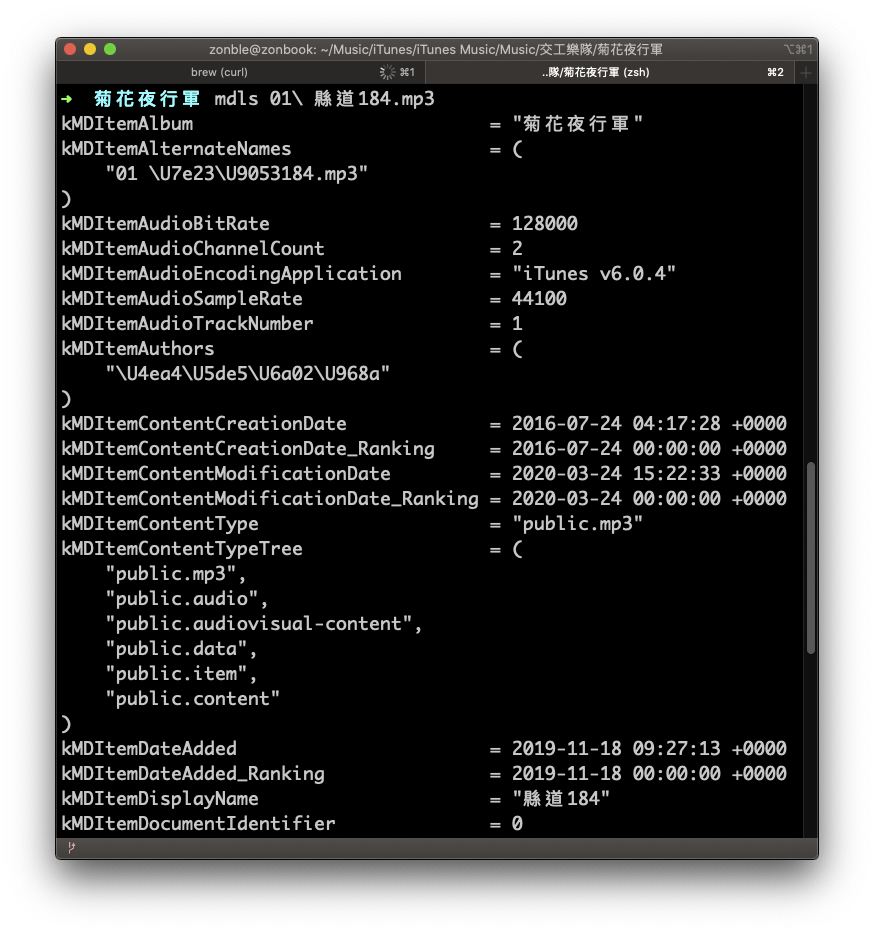
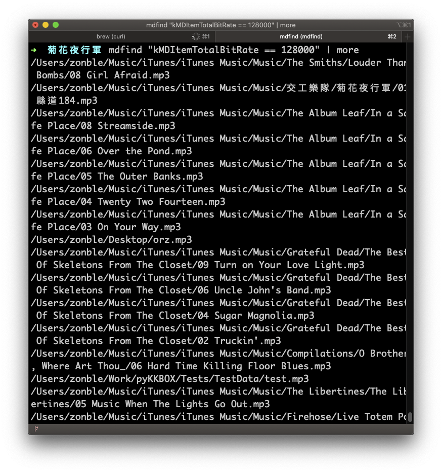

# 常用相關工具

跟音檔相關的工具非常多，我們先介紹一些常用的工具

## file 指令

如果你拿到一個檔案，卻無法確定這個檔案是什麼類型，甚至沒有副檔名可以判斷，就可以先用 `file` 這個命令列指令確認看看。

`file` 這個指令的用途，就是幫助你判斷檔案類型，在 macOS 以及很多 UNIX-like 的系統上是內建的指令，另外也有專供 Windows 平台使用的版本可以[下載](http://gnuwin32.sourceforge.net/packages/file.htm)。`file` 可以幫你檢查出非常多種種類的檔案類型，並不局限於音檔，各種圖片、文件格式，都可以檢查出來。

在下面的範例中，我們有一個檔案叫做「song」，但是沒有副檔名，`file` 很輕易的幫我們判斷出，類型是`ISO Media, Apple iTunes ALAC/AAC-LC (.M4A) Audio`—這一個 M4A 檔案，不過他覺得有可能是 AAC codec，也可能是蘋果自己的無損格式 ALAC。



## ffmpeg

[ffmpeg](https://www.ffmpeg.org) 大概是在所有平台上都相當通行的工具。這組工具在 Linux 上可以用 apt-get 等套件管理工具安裝，在 macOS 則可以用 [homebrew](https://brew.sh) 安裝，至於 Windows 版本，則可以去官網上[下載](https://www.ffmpeg.org/download.html)。

整套 ffpmeg 中，有三套工具：

- `ffmpeg`：負責檔案格式的轉換
- `ffplay`：命令列播放工具
- `ffprobe`：檔案格式解析工具

`ffprobe` 可以幫我們讀出歌曲的 metadata，以及像是 sample rate、bit rate 等基本資訊，如下圖：



我們看到，`ffprobe` 幫我們解析出

## afconvert、afplay、與 afinfo

`afconvert`、`afplay` 與 `afinfo` 是個 macOS 下的命令列指令，這三個指令，其實可以與 ffmpeg 提供的三個工具之間對應起來：

| 功能 | ffmpeg 指令 | macOS 指令 |
| ---- | ----------- | ---------- |
| 轉檔 | ffmpeg      | afconvert  |
| 播放 | ffplay      | afplay     |
| 解析 | ffprobe     | afinfo     |

跟 ffmpeg 比較，這些系統工具最主要的特色是使用 Core Audio API，所以，如果你有一個用 Core Audio 開發的播放器，想要確認是否可以順利播放，或是想知道用 Core Audio API 可以解析出哪資訊，就可以善用這些指令。相對地，如果 Core Audio 並不支援這種檔案格式（像我們在講 HLS 提到的 ts、還有前章講到的 DASH…），那麼就派不上用場了。

`afplay` 的用途是直接在命令列下播放檔案，相較於有 GUI 的播放軟體，這個指令可以直接用參數，指定要播放多久以及播放速率，比方說，下了 `afplay -t 5 -r 1.5 song.mp4` 指令，就可以用 1.5 倍速率，只播放這個檔案五秒鐘。

`afinfo` 則可以查看檔案的相關資訊。以一個 aac 檔案來說，我們可能會看到這樣的資訊：



從這裡我們就可以看到，afinfo 幫我們找出 Sample Rate 是 44100，有兩個聲道、每個 packet 有 1024 個 frame 等資訊，每個 packet 有多少 bytes 為 0，代表 bit rate 會變動，但從 bit rate 算出來是 319725，那差不多是個 320k 的音檔。afinfo 幫我們找到 9281 個 packet，算一下 9281 \* 1024 / 44100，大概 215.504399，不過 afinfo 算出來是 215.456508，似乎有點誤差，主要原因是扣去了前方 2112 個填零的 frame（priming frame）。

看到「not optimized」則要注意，這種檔案的 `moov` atom 是放在 `mdat` 後方，那麼，iOS 上的 Core Audio 的 parser，就可能無法解析這種檔案，通常我們用 `ffmpeg` 轉出的檔案 MP4 或 ALAC 檔案便會如此，這時候就可以試試看使用 `afconvert` 轉檔。請參考 [AAC 與 MP4 格式](../aac/README.md) 這一章中的說明。

## mdls 與 mdfind

這也是 macOS 上的工具，而且嚴格來說，這是 macOS 系統功能 Spottlight 搜尋工具的相關命令列工具。 `mdls` 的用途是從檔案中抽取出資訊，然後讓 Spotlight 建立檢索（index），所以 `mdls` 所呈現出來的就是根據 Spottlight 欄位的資料。

用 `mdls` 呈現出來的資料如下：



然後，因為我們知道有哪些欄位可用，所以有時候我們可以透過 `mdfind` 做一些奇特的搜尋。比方說，我們突然想要找出電腦裡頭所有 bit rate 都是 128k 的音檔，就可以用以下指令：

```sh
mdfind "kMDItemTotalBitRate == 128000"
```

結果如下：



這邊也列出一些可以試試看的搜尋條件：

- 找出電腦上所有的 FLAC 檔案：`mdfind "kMDItemContentTypeTree=org.xiph.flac"`
- 找出電腦上所有的 MP4 檔案：`mdfind "kMDItemContentTypeTree=public.mpeg-4-audio"`
- 找出電腦上所有的搖滾樂風的檔案：`mdfind "kMDItemMusicalGenre=Rock"`
- 搜尋長度大於五分鐘的檔案：`mdfind "kMDItemDurationSeconds>300"`
